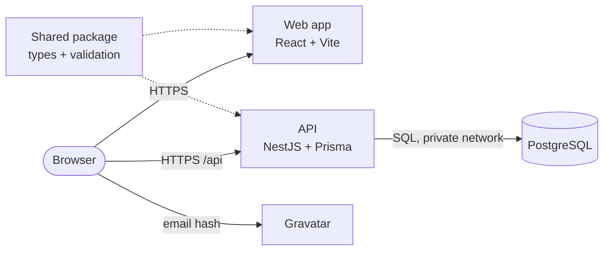

<div align="center">

# Hierarchy Hub

**A cloud hosted app for managing EPI-USE Africa's employees and who they report to.**

Add, edit and delete employees, set reporting lines, explore the organisation in a rotating 3D orbit, and sort, filter and export the whole team, with Gravatar profile pictures throughout.

[](https://github.com/Ayush-B99/hierarchyHub/actions/workflows/ci.yml)


**Live app:** [d6atm0gw3zjf0.cloudfront.net](https://d6atm0gw3zjf0.cloudfront.net) &nbsp;&nbsp;|&nbsp;&nbsp; [User guide](docs/user-guide/USER_GUIDE.md) &nbsp;&nbsp;|&nbsp;&nbsp; [Technical document](docs/technical/TECHNICAL.md) &nbsp;&nbsp;|&nbsp;&nbsp; [Beyond the brief](docs/extras/EXTRAS.md)

**Docs site:** [ayush-b99.github.io/hierarchyHub](https://ayush-b99.github.io/hierarchyHub/)


</div>

## Try it live

The app runs on AWS at **[d6atm0gw3zjf0.cloudfront.net](https://d6atm0gw3zjf0.cloudfront.net)**, with 14 sample employees and six weeks of sample history. Sign-in details are shared privately with the assessors rather than published here, because each sample account has its own generated password. Sign in as the CEO to see everything, then as someone further down to see permissions and private salaries at work.

To run it on your own machine instead, see [Running it locally](#running-it-locally).

## What it does

| Explore the organisation                                                                                                                               | Report on everyone                                                                                               |
| ------------------------------------------------------------------------------------------------------------------------------------------------------ | ---------------------------------------------------------------------------------------------------------------- |
|                                                            |                         |
| The selected person sits in the middle with their team circling them. Spin the ring, click anyone to move to them, or drag someone onto a new manager. | Sort by any column, filter by any field, page through results, and export exactly what you're looking at to CSV. |

- **Manage employees.** Add, view, edit and delete employees, with clear messages next to any field that needs fixing.
- **Set reporting lines.** Pick a manager, choose "No manager" for the CEO, or drag and drop. Nobody can manage themselves or end up in a reporting loop.
- **Delete safely.** When a manager is deleted, their team moves up to the next manager in the same step, so nobody is left reporting to someone who's gone.
- **See the hierarchy.** A rotating 3D Orbit view and a Levels view, a path to the top, and colleagues who share a manager.
- **Find anyone fast.** Search by name, email, employee number or role from any page, then view, edit or delete them.
- **Profile pictures from Gravatar,** with initials for people who don't have one.
- **Sign in, with approval.** Anyone can ask for an account, and an admin above them approves it. Passwords are hashed with Argon2id, repeated wrong guesses lock the account, and sessions end the moment an account is turned off.
- **Permissions that follow the organisation.** You can only change people below you, and about yourself only your name and email. Salaries and birth dates are private to the person and those above them.
- **A history nobody can edit.** Every change, sign in and access change is recorded with who did it, when, and what it was before. Admins see the history of their own part of the organisation.
- **A pay check.** A small regression learns what positions here usually earn, flags salaries out of line and suggests ranges, using only salaries you're allowed to see.
- **Time travel.** Drag a slider or press play to see the organisation as it was on any day, rebuilt from the audit trail.
- **Safe for teams.** If two people edit the same employee at once, the second save is stopped instead of quietly overwriting the first.
- **Comfortable to use.** Light and dark mode, phone and tablet layouts, full keyboard and screen reader support, and respect for reduced motion settings.

Every feature is explained, with screenshots, in the [user guide](docs/user-guide/USER_GUIDE.md). Everything that goes beyond the brief, in the app and under the hood, is listed in **[Beyond the brief](docs/extras/EXTRAS.md)**.

## How it meets the brief

| The brief asks for                                                        | Where to find it                                                                                                                                                              |
| ------------------------------------------------------------------------- | ----------------------------------------------------------------------------------------------------------------------------------------------------------------------------- |
| Create, read, update and delete employees                                 | Add employee button, details panel, **Edit details** and **Delete**                                                                                                           |
| Set the reporting line manager; nobody is their own manager; CEO has none | **Change manager**, or drag and drop. Enforced by the form, the API and the database                                                                                          |
| Name, surname, birth date, employee number, salary, role and manager      | Every employee record, plus email for Gravatar                                                                                                                                |
| A visual representation of the hierarchy                                  | The Explore page: Orbit and Levels views                                                                                                                                      |
| Search the hierarchy to find, edit or delete                              | **Find someone** in the top bar, on every page                                                                                                                                |
| A table that sorts and filters on any field                               | The People page                                                                                                                                                               |
| Gravatar profile pictures                                                 | Everywhere a person appears                                                                                                                                                   |
| Cloud hosted, reachable by URL                                            | AWS, at [d6atm0gw3zjf0.cloudfront.net](https://d6atm0gw3zjf0.cloudfront.net)                                                                                                  |
| No mocked data; every change saved to a remote database                   | The live database is the only data source. Sample employees were loaded into it once, and every change since goes through the app. The production build contains no mock code |
| A user guide and a short technical document                               | [User guide](docs/user-guide/USER_GUIDE.md) and [technical document](docs/technical/TECHNICAL.md)                                                                             |

The [SRS checklist](docs/srs/SRS.md#8-checklist-against-the-brief) goes through the brief line by line.

## Architecture



A React web app talks to a NestJS API, which is the only part that touches the PostgreSQL database. Everything is TypeScript, and a shared package gives the browser and the server the same types and validation rules. The hierarchy's rules are enforced three times: in the form, in the API and in the database itself. The [technical document](docs/technical/TECHNICAL.md) explains the design patterns and why each technology was chosen.

| Layer    | Technologies                                                               |
| -------- | -------------------------------------------------------------------------- |
| Web app  | React 19, Vite, React Router, TanStack Query, Three.js                     |
| API      | NestJS, Zod, Prisma with node-postgres, Helmet, NestJS Throttler           |
| Database | PostgreSQL 16, with constraints and a trigger guarding the hierarchy rules |
| Hosting  | AWS: CloudFront, S3, ECS Fargate, RDS, Secrets Manager, all as CDK code    |
| Tooling  | pnpm workspaces, Turborepo, ESLint, Prettier, Husky, GitHub Actions        |
| Testing  | Vitest, Jest, Testing Library, Supertest, MSW, axe                         |

## Repository structure

```text
hierarchyHub/
├── apps/
│   ├── api/                        NestJS REST API (@hierarchy-hub/api)
│   │   ├── prisma/                 Schema, migrations, database setup scripts, local sample data
│   │   ├── src/
│   │   │   ├── common/             Validation, error handling, request ids, If-Match checks, rate limits
│   │   │   ├── config/             Settings, checked when the API starts
│   │   │   ├── database/           Connection pool, Prisma client, database error mapping
│   │   │   ├── employees/          Controller → service → repository, and the response mapper
│   │   │   └── health/             Health checks for the load balancer
│   │   └── test/                   End-to-end tests, and integration tests against real PostgreSQL
│   └── web/                        React single page app (@hierarchy-hub/web)
│       └── src/
│           ├── app/                Providers and routes
│           ├── components/         UI building blocks, layout, 3D background, feedback, motion
│           ├── features/
│           │   ├── employees/      Add, edit, change manager and delete dialogs
│           │   ├── explore/        Orbit and Levels views, path to the top, details panel
│           │   ├── people/         Sentence filters, table, paging and CSV export
│           │   └── search/         Find someone, in the top bar
│           ├── lib/                API client, Gravatar, formatting, query client
│           ├── mocks/              Mock API, for automated tests and optional design work
│           ├── pages/              Explore, People and not found
│           └── styles/, theme/     Design tokens and light and dark themes
├── infra/                          AWS setup as code (CDK), its tests, and the operations script
├── packages/
│   ├── shared/                     Types, Zod schemas, hierarchy helpers and contract examples (@hierarchy-hub/shared)
│   ├── tsconfig/                   Shared TypeScript settings
│   └── eslint-config/              Shared lint rules
├── docs/
│   ├── srs/                        What the system must do, and the checklist against the brief
│   ├── sas/                        How it is built: diagrams, data, flows and hosting
│   ├── adr/                        15 architecture decision records
│   ├── technical/                  The technical document
│   ├── user-guide/                 The user guide, with screenshots
│   ├── api/                        The REST API contract
│   ├── design/                     Brand guide, visual direction and the design concept
│   ├── extras/                     Everything built beyond the brief
│   └── planning/                   The roadmap
├── .github/                        CI workflow, Dependabot, CODEOWNERS and templates
├── docs-site/                      MkDocs build hook and pinned Python requirements for the docs site
├── docker-compose.yml              Local PostgreSQL, set up exactly as on AWS
├── mkdocs.yml                      The docs site: theme, navigation and plugins
├── Taskfile.yml                    Short commands for setup, development and checks
├── turbo.json                      Build and test pipeline, with caching
└── pnpm-workspace.yaml             Workspace packages and shared dependency versions
```

`apps/` are the parts that get deployed. `packages/` are internal libraries used by the apps, never deployed on their own.

## Running it locally

### Prerequisites

- Node.js 22.12 or newer (`nvm use` reads `.nvmrc`)
- pnpm 10 (`corepack enable` installs the pinned version)
- [Task](https://taskfile.dev) for the short commands (`brew install go-task` on macOS)
- [Docker Desktop](https://www.docker.com/products/docker-desktop/) for the local database

### Getting started

```bash
task setup     # install dependencies, create .env files, start and migrate the database
task db:seed   # load the sample people and sample accounts into your local database
task dev       # start the web app and the API
```

- Web app: http://localhost:5173, using the real API and your local database
- API: http://localhost:3000/api/health

Sign in as `thandi.nkosi@example.com` (the CEO, an admin) with the password `hierarchy hub demo`. The seed prints the other sample accounts: another admin, a manager, someone without a team, and someone waiting for approval.

The sample people and accounts can only be loaded into a database on your own machine. The seed script refuses to run against any other database. On a real database, create the first admin with `task admin:create EMPLOYEE=EMP-0001`, which asks for a password without showing it. Every other account is approved from inside the app.

### Common commands

Run `task` on its own to see every command. The main ones:

| Command                                         | What it does                                                                     |
| ----------------------------------------------- | -------------------------------------------------------------------------------- |
| `task dev`                                      | Start the web app and the API together                                           |
| `task web`, `task api`                          | Start just one of them                                                           |
| `task web:mock`                                 | Start just the web app, against the mock API (no backend needed)                 |
| `task check`                                    | Run everything CI runs: format, lint, types, every test, build                   |
| `task unit`                                     | Run all unit tests                                                               |
| `task integration`                              | Run the database integration tests                                               |
| `task e2e`                                      | Run the API end-to-end tests against the test database                           |
| `task db:seed`, `task db:reset`, `task db:psql` | Load sample people, start the database fresh, open a SQL prompt                  |
| `task admin:create EMPLOYEE=...`                | Make an employee an admin who can sign in, for the first admin on a new database |
| `task build`, `task clean`                      | Build everything, or remove build output and caches                              |
| `task docs`, `task docs:build`                  | Preview the docs site at http://localhost:8000, or build it strictly as CI does  |

Every command is a shortcut for a pnpm script, so `pnpm dev`, `pnpm test` or `pnpm --filter @hierarchy-hub/api test:e2e` work too. The full list is in `Taskfile.yml`.

## Testing

| Suite                | What it covers                                                                                                    | Tests |
| -------------------- | ----------------------------------------------------------------------------------------------------------------- | ----- |
| Web                  | Screens, forms, search, drag and drop, the orbit, clashes, accessibility, CSV export                              | 174   |
| Shared               | Validation rules and hierarchy helpers                                                                            | 61    |
| API unit             | Services, mappers, settings, error handling, version checks                                                       | 37    |
| Database integration | Constraints, the reporting loop trigger, clashing changes, against real PostgreSQL                                | 37    |
| API end to end       | Every endpoint and rule over HTTP, every attack we tried, security, rate limits, speed with 10,000 people         | 213   |
| Infrastructure       | The AWS setup: no NAT gateway, private encrypted database, API only through CloudFront, secrets only where needed | 11    |

Every pull request runs all of them in GitHub Actions, against a real PostgreSQL database, along with formatting, linting, type checks and the build.

## Documentation

| Document                                          | What it covers                                                                                                     |
| ------------------------------------------------- | ------------------------------------------------------------------------------------------------------------------ |
| [User guide](docs/user-guide/USER_GUIDE.md)       | How to use every feature, with screenshots                                                                         |
| [Technical document](docs/technical/TECHNICAL.md) | Architecture, design patterns, technologies and why                                                                |
| [Beyond the brief](docs/extras/EXTRAS.md)         | Every extra feature and engineering choice beyond the brief, with where to see it                                  |
| [Requirements (SRS)](docs/srs/SRS.md)             | Use case diagrams, functional and non-functional requirements, what was built, and the checklist against the brief |
| [Architecture (SAS)](docs/sas/SAS.md)             | Architecture and deployment diagrams, data model, request flows and the delivery pipeline                          |
| [Decision records](docs/adr/README.md)            | One short record per major decision, with the options considered                                                   |
| [Deploying](docs/deploy/DEPLOY.md)                | Setting up the live site on AWS, and turning it off                                                                |
| [API contract](docs/api/API.md)                   | Every endpoint, with examples and error codes                                                                      |
| [Brand guide](docs/design/BRAND.md)               | Logo, colours, typography, motion, and voice and tone                                                              |
| [Design](docs/design/README.md)                   | The clay and glass visual direction and its building blocks                                                        |
| [Roadmap](docs/planning/ROADMAP.md)               | How the project was built, part by part                                                                            |

## Contributing

See [CONTRIBUTING.md](CONTRIBUTING.md) for branching, commit messages and the pull request process.
