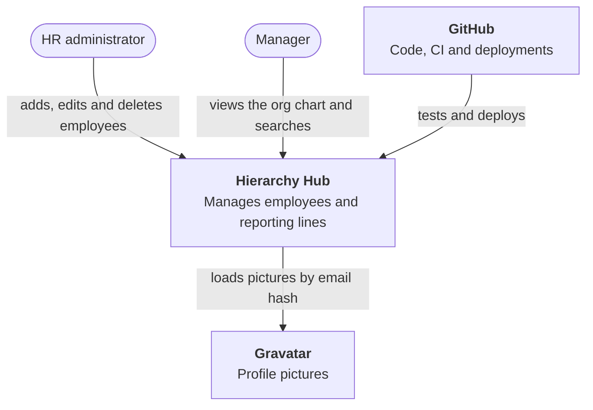
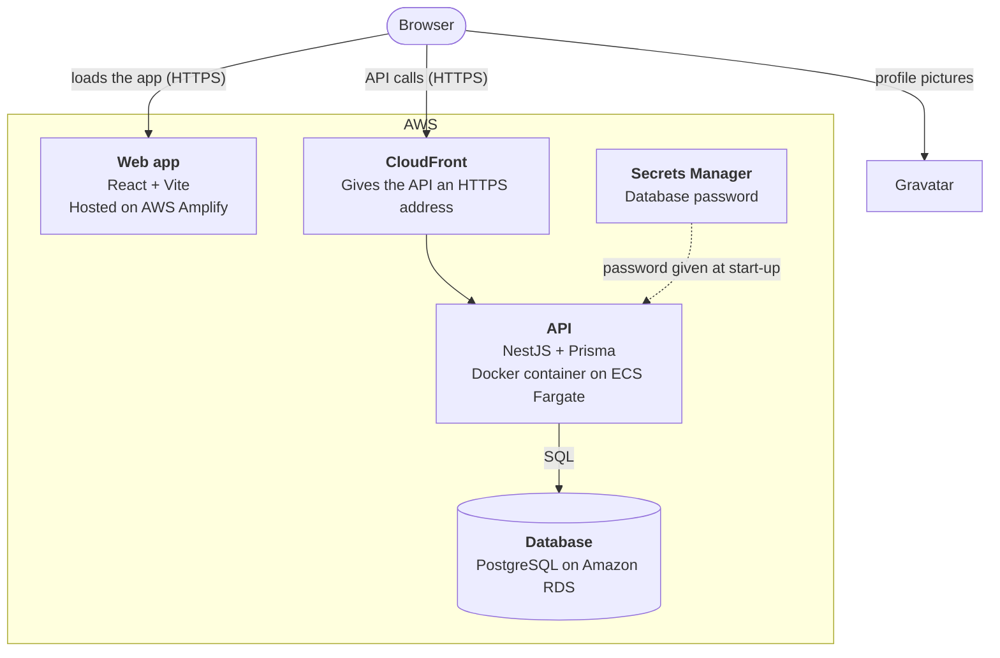
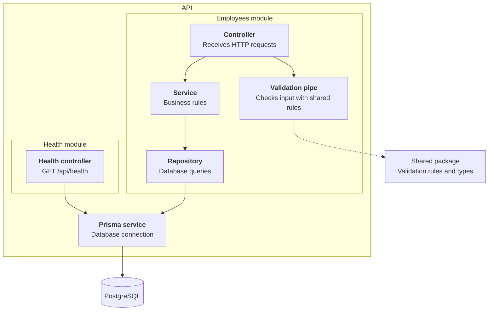
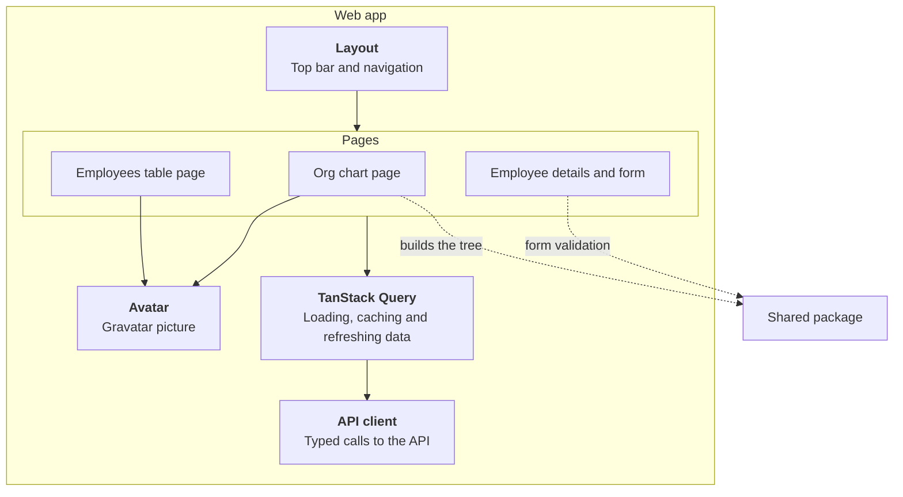
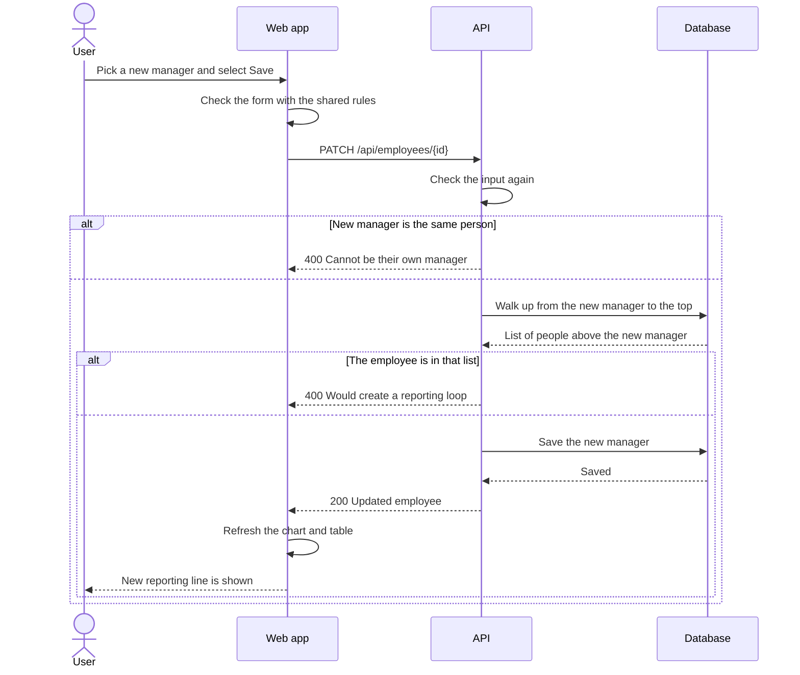
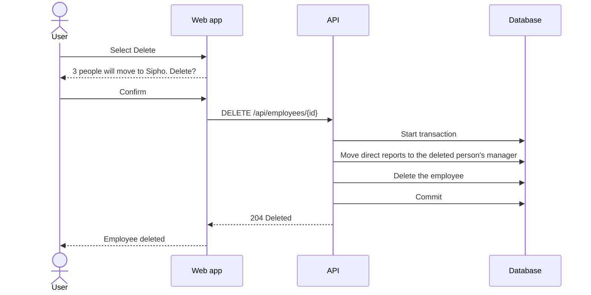
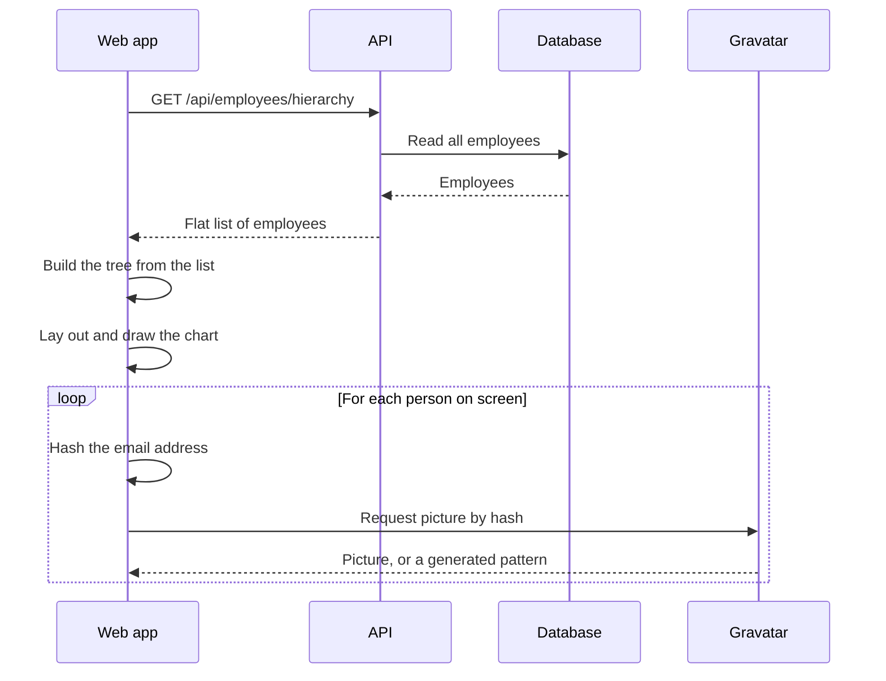
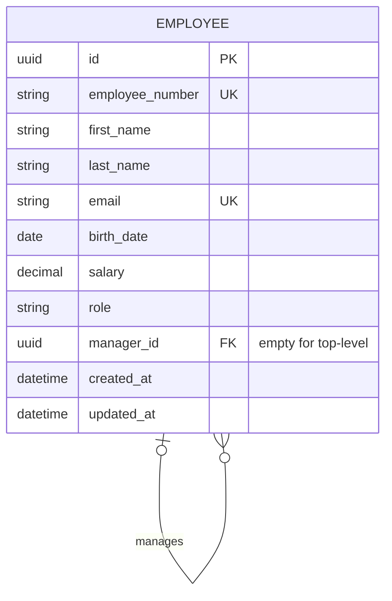
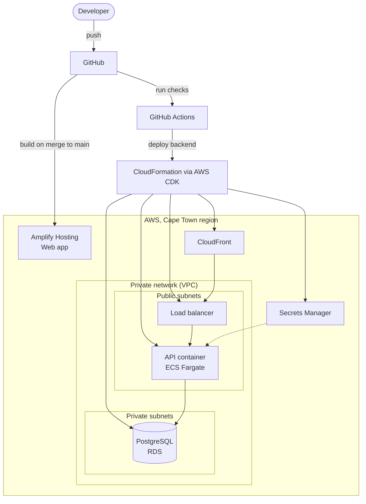

# Software Architecture Specification (SAS)

|         |                                                                                                 |
| ------- | ----------------------------------------------------------------------------------------------- |
| Project | Hierarchy Hub                                                                                   |
| Version | 0.1 (draft)                                                                                     |
| Date    | October 2026                                                                                    |
| Related | [SRS](../srs/SRS.md), [ADRs](../adr/README.md), [Technical document](../technical/TECHNICAL.md) |

## 1. Purpose

This document explains how Hierarchy Hub is built. It shows the main parts of the system, how they talk to each other, how data is stored, and where everything is hosted. The diagrams follow the [C4 model](https://c4model.com/), which looks at the system at different levels of detail: first the whole system, then its main parts, then the pieces inside each part.

## 2. What drives the design

These requirements have the biggest effect on how the system is built.

| Requirement                                                                     | What it means for the design                                                                   |
| ------------------------------------------------------------------------------- | ---------------------------------------------------------------------------------------------- |
| No one can manage themselves and there can be no reporting loops (BR-01, BR-02) | Use a relational database that can enforce rules. Check for loops before every manager change. |
| All data must be in a remote database (C-01)                                    | A managed PostgreSQL database on AWS. Only the API writes to it.                               |
| Sort and filter on any field (FR-10)                                            | Sorting and filtering happen in the database, using indexes.                                   |
| Visual org chart (FR-07)                                                        | The API sends the full list of employees once. The browser builds the tree.                    |
| Hosted in the cloud with a URL (C-03)                                           | AWS, with all resources defined in code.                                                       |
| Easy to maintain and review (NFR-09)                                            | TypeScript monorepo, shared validation rules, clear layers in the code.                        |

In order of importance, the system should be: correct, easy to use, easy to maintain, secure, cheap to run, and fast enough.

## 3. System context

The whole system and what it connects to.



## 4. Main parts (containers)



| Part           | Job                                                                                        | Built with                                                            |
| -------------- | ------------------------------------------------------------------------------------------ | --------------------------------------------------------------------- |
| Web app        | Screens: org chart, table, forms. Checks input before sending it. Shows Gravatar pictures. | React, Vite, TanStack Query, React Router, React Flow, TanStack Table |
| CloudFront     | Gives the API a secure HTTPS address without buying a domain name.                         | Amazon CloudFront                                                     |
| API            | Business rules, input checks, saving and reading data.                                     | NestJS, Prisma, Zod                                                   |
| Database       | Stores employees and enforces key rules.                                                   | PostgreSQL 16 on Amazon RDS                                           |
| Shared package | Types and validation rules used by both the web app and the API.                           | TypeScript, Zod. Not deployed on its own.                             |

## 5. Inside the API

The API is split into modules. Each module has three layers, and each layer only talks to the one below it.



| Layer      | Does                                                  | Does not                                 |
| ---------- | ----------------------------------------------------- | ---------------------------------------- |
| Controller | Maps URLs to methods. Returns HTTP responses.         | Contain business rules or database code. |
| Service    | Applies business rules, such as "no reporting loops". | Know about HTTP or SQL.                  |
| Repository | Runs database queries.                                | Decide what is allowed.                  |

## 6. Inside the web app



## 7. Main flows

### 7.1 Change an employee's manager



### 7.2 Delete an employee who manages people



### 7.3 Load the org chart



## 8. Data

### 8.1 How the hierarchy is stored

Each employee row has a `manager_id` column that points to another employee. If it is empty, the employee is at the top. This is called an adjacency list. It is the simplest way to store a tree, and changing someone's manager only updates one row. See [ADR 0003](../adr/0003-postgresql-adjacency-list.md) for the other options we looked at.



### 8.2 Rules enforced by the database

| Rule                                                                 | How                                                                                                                                              |
| -------------------------------------------------------------------- | ------------------------------------------------------------------------------------------------------------------------------------------------ |
| Not their own manager (BR-01)                                        | A check constraint: `manager_id` must not equal `id`.                                                                                            |
| Manager must exist, and can't be deleted while people report to them | A foreign key from `manager_id` to `id`, with `ON DELETE NO ACTION`.                                                                             |
| Unique employee number and email, ignoring capitals (BR-05)          | Unique indexes, with values always stored in one case.                                                                                           |
| Birth date in the past (BR-07), names not blank                      | A trigger and check constraints.                                                                                                                 |
| No lost updates when two people edit at once                         | A `version` on every row, increased by the database on every change.                                                                             |
| Salary not negative (BR-06)                                          | A check constraint and a decimal type with 2 places.                                                                                             |
| No reporting loops (BR-02)                                           | A database trigger walks up the management chain on every manager change, and takes a short lock so two clashing changes can't both get through. |

### 8.3 Indexes

Indexes make sorting, filtering and tree lookups fast. We index `manager_id`, `last_name` with `first_name`, and `role`, plus the unique indexes above.

## 9. Hosting



Key points:

- The web app is a set of static files served by Amplify over HTTPS.
- The API runs as a Docker container on ECS Fargate, so there are no servers to manage. The load balancer checks `/api/health` and restarts the container if it fails.
- CloudFront sits in front of the load balancer to give the API an HTTPS address. Without it, the HTTPS website could not call the API.
- The database is in private subnets with no internet access. Only the API container can connect to it.
- We do not use a NAT gateway. It is the most expensive part of a typical small AWS setup and we do not need it.
- The Cape Town region (`af-south-1`) keeps employee data in South Africa. If that region is not enabled on the account, we use Ireland (`eu-west-1`).
- Database changes (migrations) run automatically when the API container starts.

## 10. Design patterns

| Pattern                | Where                                | Why                                                                        |
| ---------------------- | ------------------------------------ | -------------------------------------------------------------------------- |
| Layered architecture   | API: controller, service, repository | Each layer has one job, so it is easier to test and change.                |
| Modular monolith       | NestJS modules                       | One app to deploy, but split into clear feature modules.                   |
| Dependency injection   | NestJS                               | Classes get what they need from the framework, so tests can swap in fakes. |
| Repository             | `EmployeesRepository`                | Keeps database code in one place, away from business rules.                |
| DTO and mapper         | API responses                        | The API's response shape does not change when the database changes.        |
| Shared kernel          | `packages/shared`                    | One set of types and validation rules for both web app and API.            |
| Composite              | Org chart tree                       | Every node in the tree is handled the same way, so drawing it is simple.   |
| Adapter                | Gravatar helper, API client          | Wraps outside services in small, typed functions.                          |
| Unit of work           | Delete with reassignment             | Several database changes succeed or fail together.                         |
| Infrastructure as code | AWS CDK                              | The cloud setup can be rebuilt from code at any time.                      |

## 11. Cross-cutting concerns

| Concern       | Approach                                                                                                                                                                                                                        |
| ------------- | ------------------------------------------------------------------------------------------------------------------------------------------------------------------------------------------------------------------------------- |
| Validation    | Zod rules in the shared package are used by the web forms and again by the API.                                                                                                                                                 |
| Errors        | The API always returns errors in the same JSON shape. The web app shows them next to the right field or at the top of the page.                                                                                                 |
| Configuration | Settings come from environment variables and are checked when the API starts. Each app has a `.env.example` file.                                                                                                               |
| Logging       | The API logs to the console. On AWS these logs go to CloudWatch. Personal data is not logged.                                                                                                                                   |
| Security      | HTTPS everywhere, private database, secrets in Secrets Manager, CORS limited to the web app's address, Dependabot for updates. Two database users: the API's user can only read and write rows, never change tables (ADR 0010). |
| Caching       | Browser cache (TanStack Query), HTTP ETags with 304 responses, and database indexes. No Redis yet (ADR 0011).                                                                                                                   |
| Testing       | Unit tests (Jest for the API, Vitest for the web app and shared package). API tests against a real PostgreSQL database in CI. A browser smoke test with Playwright.                                                             |
| CI/CD         | GitHub Actions checks formatting, linting, types, tests and builds on every pull request. Merges to `main` deploy automatically.                                                                                                |

## 12. Risks

| Risk                                                                   | What we do about it                                                                                 |
| ---------------------------------------------------------------------- | --------------------------------------------------------------------------------------------------- |
| Two people change managers at the same moment and create a loop.       | Solved: the database trigger takes a lock, so manager changes are checked one at a time (ADR 0010). |
| A very large org chart is slow to draw.                                | Collapse teams below a certain level by default and only draw what is on screen.                    |
| No login in the first version, so anyone with the URL can change data. | Acceptable for the assessment. Login is planned as an extra (FR-17).                                |
| The Cape Town region is not enabled on the AWS account.                | Use Ireland (`eu-west-1`) instead.                                                                  |
| AWS free tier rules change.                                            | Use the smallest sizes and remove everything after the assessment.                                  |

## 13. Repository layout

```text
hierarchyHub/
├── apps/
│   ├── api/              NestJS API
│   └── web/              React web app
├── packages/
│   ├── shared/           Shared types and validation rules
│   ├── tsconfig/         Shared TypeScript settings
│   └── eslint-config/    Shared lint rules
├── infra/                AWS CDK code (added in a later part)
├── docs/                 This documentation
└── .github/              CI workflows and templates
```
