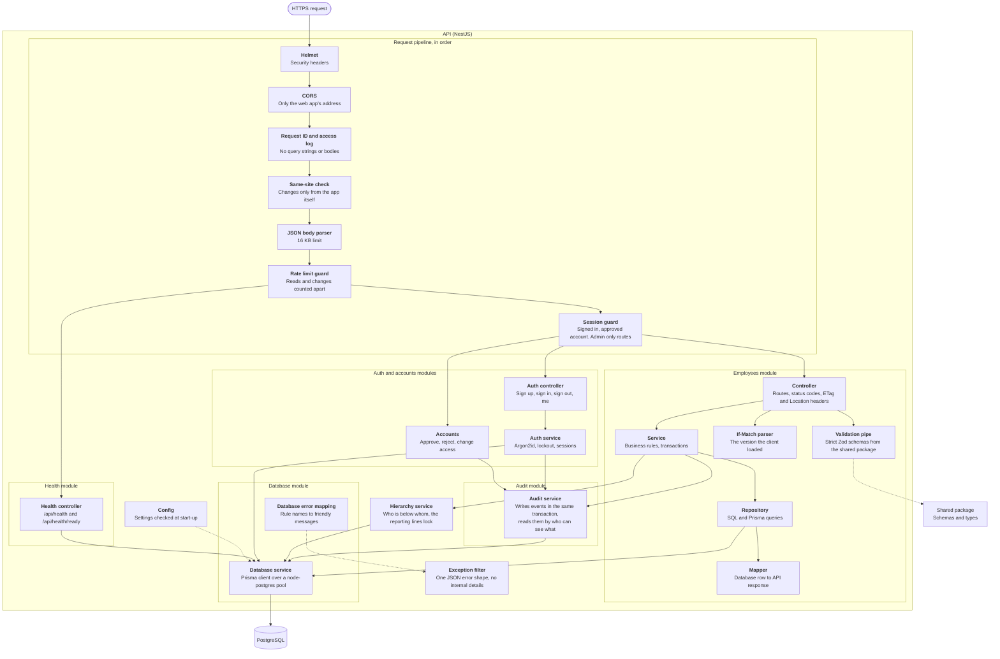
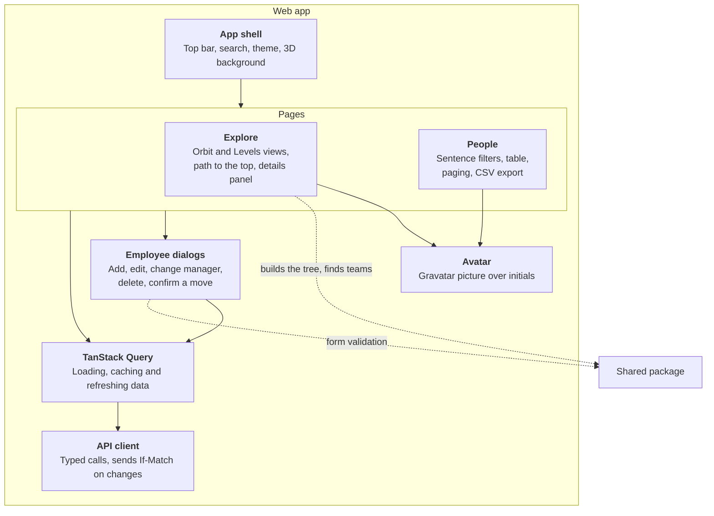
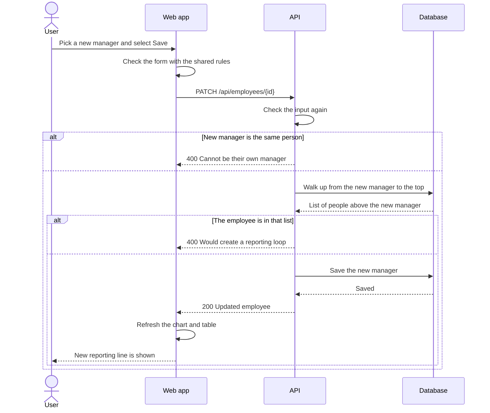
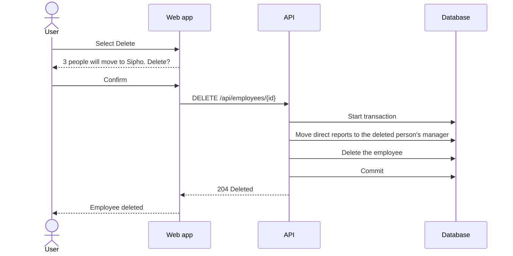
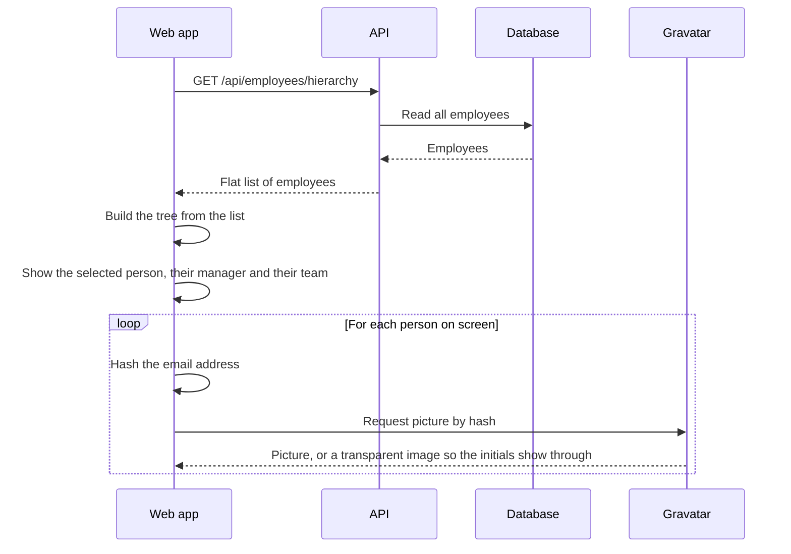
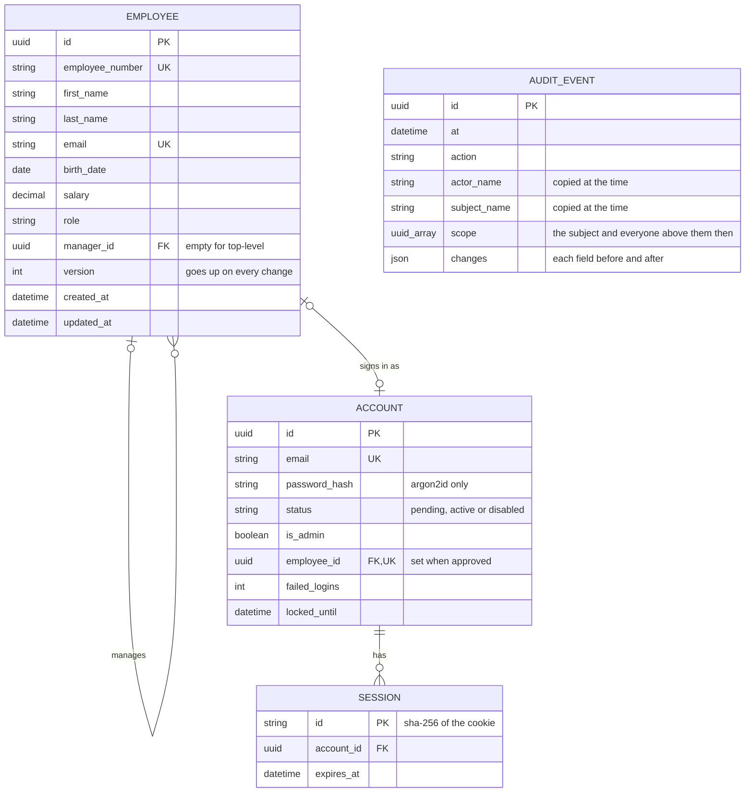
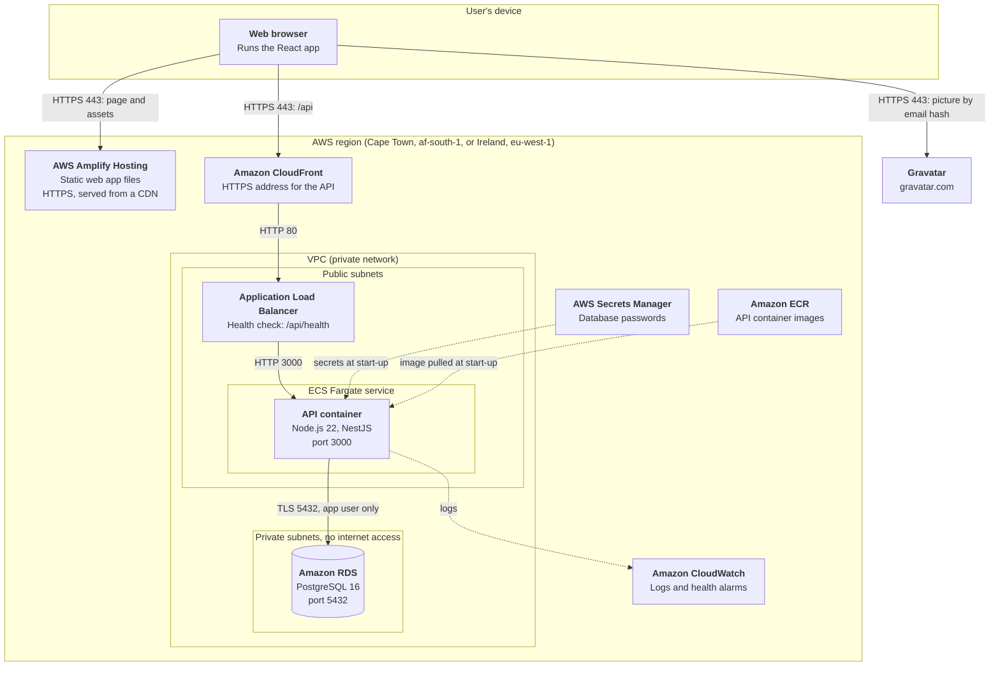
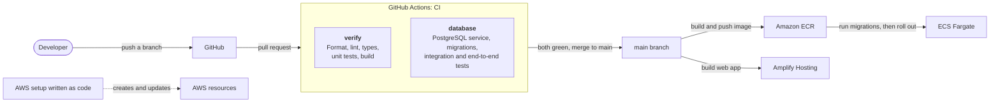

# Software Architecture Specification (SAS)

|         |                                                                                                 |
| ------- | ----------------------------------------------------------------------------------------------- |
| Project | Hierarchy Hub                                                                                   |
| Version | 1.0                                                                                             |
| Date    | October 2026                                                                                    |
| Related | [SRS](../srs/SRS.md), [ADRs](../adr/README.md), [Technical document](../technical/TECHNICAL.md) |

## 1. Purpose

This document explains how Hierarchy Hub is built. It shows the main parts of the system, how they talk to each other, how data is stored, and where everything is hosted. The diagrams follow the [C4 model](https://c4model.com/), which looks at the system at different levels of detail: first the whole system, then its main parts, then the pieces inside each part.

## 2. What drives the design

These requirements have the biggest effect on how the system is built.

| Requirement                                                                     | What it means for the design                                                                   |
| ------------------------------------------------------------------------------- | ---------------------------------------------------------------------------------------------- |
| No one can manage themselves and there can be no reporting loops (BR-01, BR-02) | Use a relational database that can enforce rules. Check for loops before every manager change. |
| All data must be in a remote database (C-01)                                    | A managed PostgreSQL database on AWS. Only the API writes to it.                               |
| Sort and filter on any field (FR-10)                                            | Sorting and filtering happen in the database, using indexes.                                   |
| Visual org chart (FR-07)                                                        | The API sends the full list of employees once. The browser builds the tree.                    |
| Hosted in the cloud with a URL (C-03)                                           | AWS, with all resources defined in code.                                                       |
| Easy to maintain and review (NFR-09)                                            | TypeScript monorepo, shared validation rules, clear layers in the code.                        |

In order of importance, the system should be: correct, easy to use, easy to maintain, secure, cheap to run, and fast enough.

## 3. System context

The whole system and what it connects to.


## 4. Main parts (containers)


| Part           | Job                                                                                        | Built with                                                                                                |
| -------------- | ------------------------------------------------------------------------------------------ | --------------------------------------------------------------------------------------------------------- |
| Web app        | Screens: org chart, table, forms. Checks input before sending it. Shows Gravatar pictures. | React, Vite, TanStack Query, React Router, Three.js. The org chart and table are built by hand (ADR 0014) |
| CloudFront     | Gives the API a secure HTTPS address without buying a domain name.                         | Amazon CloudFront                                                                                         |
| API            | Business rules, input checks, saving and reading data.                                     | NestJS, Prisma, Zod                                                                                       |
| Database       | Stores employees and enforces key rules.                                                   | PostgreSQL 16 on Amazon RDS                                                                               |
| Shared package | Types and validation rules used by both the web app and the API.                           | TypeScript, Zod. Not deployed on its own.                                                                 |

## 5. Inside the API

Every request passes through the same pipeline before it reaches an endpoint, then down through three layers. Each layer only talks to the one below it. Every route needs a signed in, approved account except the health checks and the sign in forms (ADR 0016), what each person may change follows the hierarchy (ADR 0017), and every change is recorded in the same transaction (ADR 0018).



| Layer      | Does                                                  | Does not                                 |
| ---------- | ----------------------------------------------------- | ---------------------------------------- |
| Controller | Maps URLs to methods. Returns HTTP responses.         | Contain business rules or database code. |
| Service    | Applies business rules, such as "no reporting loops". | Know about HTTP or SQL.                  |
| Repository | Runs database queries.                                | Decide what is allowed.                  |

## 6. Inside the web app



The selected person, view, filters, sort and page are kept in the address bar, so the back button, bookmarks and shared links all work.

## 7. Main flows

### 7.1 Change an employee's manager



### 7.2 Delete an employee who manages people



### 7.3 Load the org chart



## 8. Data

### 8.1 How the hierarchy is stored

Each employee row has a `manager_id` column that points to another employee. If it is empty, the employee is at the top. This is called an adjacency list. It is the simplest way to store a tree, and changing someone's manager only updates one row. See [ADR 0003](../adr/0003-postgresql-adjacency-list.md) for the other options we looked at.



Accounts link to employees one to one. Sessions belong to an account and are deleted with it. Audit events deliberately have no links to anything: they copy the names and positions they need at the time, so they still read correctly after people are renamed, moved or deleted, and deleting someone can never touch their history. The audit table is append only (ADR 0018).

### 8.2 Rules enforced by the database

| Rule                                                                 | How                                                                                                                                              |
| -------------------------------------------------------------------- | ------------------------------------------------------------------------------------------------------------------------------------------------ |
| Not their own manager (BR-01)                                        | A check constraint: `manager_id` must not equal `id`.                                                                                            |
| Manager must exist, and can't be deleted while people report to them | A foreign key from `manager_id` to `id`, with `ON DELETE NO ACTION`.                                                                             |
| Unique employee number and email, ignoring capitals (BR-05)          | Unique indexes, with values always stored in one case.                                                                                           |
| At least 15 years old (BR-07), names not blank                       | A trigger and check constraints.                                                                                                                 |
| No lost updates when two people edit at once                         | A `version` on every row, increased by the database on every change.                                                                             |
| Salary not negative (BR-06)                                          | A check constraint and a decimal type with 2 places.                                                                                             |
| No reporting loops (BR-02)                                           | A database trigger walks up the management chain on every manager change, and takes a short lock so two clashing changes can't both get through. |

### 8.3 Indexes

Indexes make sorting, filtering and tree lookups fast. We index `manager_id`, `last_name` with `first_name`, and `role`, plus the unique indexes above.

## 9. Hosting and deployment

The hosting design follows ADR 0004. Exact sizes and the region are confirmed during deployment.

### 9.1 Deployment diagram

What runs where in production, and how the pieces connect.



| Node            | What it holds                                     | Why it's set up this way                                                                             |
| --------------- | ------------------------------------------------- | ---------------------------------------------------------------------------------------------------- |
| Amplify Hosting | The built web app: HTML, JavaScript, CSS, fonts   | Static files over HTTPS, cached close to users, rebuilt from GitHub on every merge.                  |
| CloudFront      | Nothing, it forwards API calls                    | Gives the API an HTTPS address without buying a domain. Without HTTPS, the web app couldn't call it. |
| Load balancer   | Nothing, it routes                                | Checks `/api/health` and replaces a container that stops answering.                                  |
| ECS Fargate     | The API container                                 | Runs the same image as local Docker and CI, with no servers to patch.                                |
| RDS             | The employees database                            | Managed backups and patches. In private subnets, so only the API's security group can reach it.      |
| Secrets Manager | Database passwords for the app and migrator users | Secrets never sit in git, images or environment files.                                               |
| CloudWatch      | API logs and alarms                               | Logs carry request IDs, never personal data (NFR-05).                                                |

Other points:

- There is no NAT gateway. It is the most expensive part of a typical small AWS setup, and nothing in the private subnets needs the internet.
- The API connects to the database with the `hh_app` user, which can only read and write rows. Migrations use the separate `hh_migrator` user (ADR 0010).
- `TRUST_PROXY` is 2 (CloudFront and the load balancer), so rate limits see each visitor's real address (ADR 0013).
- The Cape Town region keeps employee data in South Africa. If it isn't enabled on the account, Ireland is used instead.

### 9.2 Delivery pipeline

How a change gets from a developer's machine to production.



- Nothing reaches `main` unless both CI jobs pass.
- The database job builds a fresh PostgreSQL from the same setup scripts used locally and on AWS, so all three environments match.
- New API containers only receive traffic once they pass the health check, so a broken release never replaces a working one.
- A separate Docs workflow builds the documentation site on every pull request, in strict mode, and publishes it to GitHub Pages from `main` (ADR 0015).

### 9.3 Environments

| Environment | Web app                    | API                           | Database                                                          | Used for                    |
| ----------- | -------------------------- | ----------------------------- | ----------------------------------------------------------------- | --------------------------- |
| Local       | Vite dev server, port 5173 | Node.js, port 3000            | PostgreSQL 16 in Docker: `hierarchy_hub` and `hierarchy_hub_test` | Building and testing        |
| CI          | Built, not served          | Booted inside the test runner | PostgreSQL 16 service container: `hierarchy_hub_test` only        | Checking every pull request |
| Production  | Amplify Hosting            | ECS Fargate                   | Amazon RDS                                                        | The live app                |

## 10. Design patterns

| Pattern                | Where                                | Why                                                                        |
| ---------------------- | ------------------------------------ | -------------------------------------------------------------------------- |
| Layered architecture   | API: controller, service, repository | Each layer has one job, so it is easier to test and change.                |
| Modular monolith       | NestJS modules                       | One app to deploy, but split into clear feature modules.                   |
| Dependency injection   | NestJS                               | Classes get what they need from the framework, so tests can swap in fakes. |
| Repository             | `EmployeesRepository`                | Keeps database code in one place, away from business rules.                |
| DTO and mapper         | API responses                        | The API's response shape does not change when the database changes.        |
| Shared kernel          | `packages/shared`                    | One set of types and validation rules for both web app and API.            |
| Optimistic concurrency | `version` column, ETag and If-Match  | A second save made from an old copy is refused instead of overwriting.     |
| Contract testing       | `packages/shared/src/testing`        | The same examples run against the mock API and the real API.               |
| Adapter                | Gravatar helper, API client          | Wraps outside services in small, typed functions.                          |
| Unit of work           | Delete with reassignment             | Several database changes succeed or fail together.                         |
| Infrastructure as code | AWS CDK                              | The cloud setup can be rebuilt from code at any time.                      |

The Gang of Four patterns used inside the code (Singleton, Factory, Builder, Adapter, Facade, Chain of Responsibility, Template Method, Strategy, Observer and Mediator) are listed with their locations in the [technical document, section 4.2](../technical/TECHNICAL.md#42-gang-of-four-patterns).

## 11. Cross-cutting concerns

| Concern       | Approach                                                                                                                                                                                                                                                                                                                                   |
| ------------- | ------------------------------------------------------------------------------------------------------------------------------------------------------------------------------------------------------------------------------------------------------------------------------------------------------------------------------------------ |
| Validation    | Zod rules in the shared package are used by the web forms and again by the API.                                                                                                                                                                                                                                                            |
| Errors        | The API always returns errors in the same JSON shape. The web app shows them next to the right field or at the top of the page.                                                                                                                                                                                                            |
| Configuration | Settings come from environment variables and are checked when the API starts. Each app has a `.env.example` file.                                                                                                                                                                                                                          |
| Logging       | The API logs to the console. On AWS these logs go to CloudWatch. Personal data is not logged.                                                                                                                                                                                                                                              |
| Security      | HTTPS everywhere, private database, secrets in Secrets Manager, Dependabot. Two database users, the API's can only read and write rows (ADR 0010). The API adds security headers, CORS limited to the web app, rate limits, a 16 KB request limit, strict input checks, version checks on every change and request IDs in logs (ADR 0013). |
| Caching       | Browser cache (TanStack Query), HTTP ETags with 304 responses, and database indexes. No Redis yet (ADR 0011).                                                                                                                                                                                                                              |
| Testing       | Unit tests (Jest for the API, Vitest for the web app and shared package). API tests against a real PostgreSQL database in CI. A browser smoke test with Playwright.                                                                                                                                                                        |
| CI/CD         | GitHub Actions checks formatting, linting, types, tests and builds on every pull request. Merges to `main` deploy automatically.                                                                                                                                                                                                           |

## 12. Risks

| Risk                                                                   | What we do about it                                                                                 |
| ---------------------------------------------------------------------- | --------------------------------------------------------------------------------------------------- |
| Two people change managers at the same moment and create a loop.       | Solved: the database trigger takes a lock, so manager changes are checked one at a time (ADR 0010). |
| A very large org chart is slow to draw.                                | Solved: the Orbit and Levels views only draw one person's surroundings (ADR 0014).                  |
| No login in the first version, so anyone with the URL can change data. | Acceptable for the assessment. Login is planned as an extra (FR-17).                                |
| The Cape Town region is not enabled on the AWS account.                | Use Ireland (`eu-west-1`) instead.                                                                  |
| AWS free tier rules change.                                            | Use the smallest sizes and remove everything after the assessment.                                  |

## 13. Repository layout

```text
hierarchyHub/
├── apps/
│   ├── api/              NestJS API, Prisma schema, migrations and tests
│   └── web/              React web app and its tests
├── packages/
│   ├── shared/           Shared types, validation rules and contract examples
│   ├── tsconfig/         Shared TypeScript settings
│   └── eslint-config/    Shared lint rules
├── docs/                 This documentation
├── .github/              CI workflow and templates
├── docker-compose.yml    Local PostgreSQL, set up the same way as on AWS
└── Taskfile.yml          Short commands for setup, development and checks
```

The AWS infrastructure code is added with the deployment (ADR 0004).
