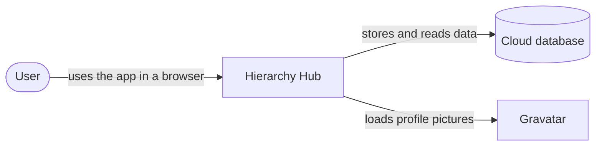
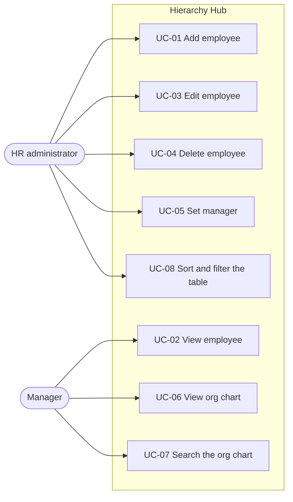
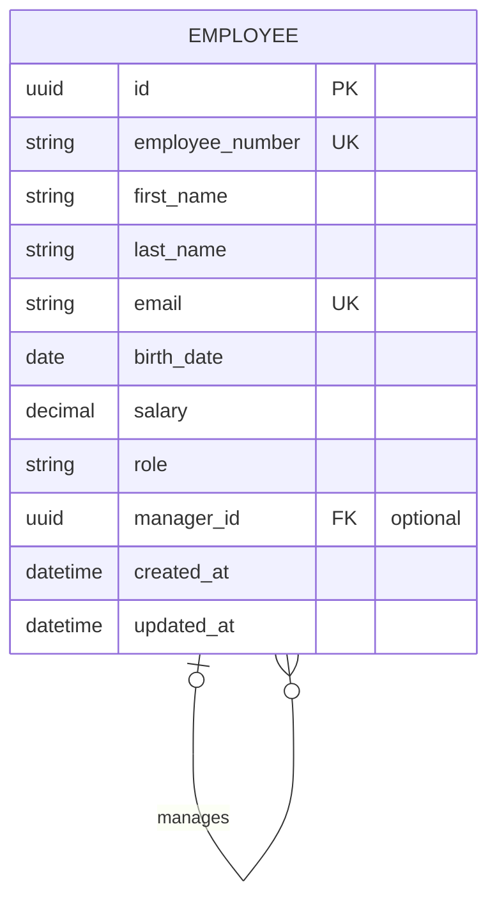

# Software Requirements Specification (SRS)

|         |                |
| ------- | -------------- |
| Project | Hierarchy Hub  |
| Client  | EPI-USE Africa |
| Version | 0.1 (draft)    |
| Date    | October 2026   |

## 1. Introduction

### 1.1 Purpose

This document describes what Hierarchy Hub must do. It is used to plan the work, to build the system, and to test it. Every requirement has an ID (for example `FR-05`) so it can be referenced in issues, pull requests and tests.

### 1.2 Scope

Hierarchy Hub is a web application that lets EPI-USE Africa manage its employees and their reporting lines. Users can:

- add, view, edit and delete employees
- set who each employee reports to
- see the organisation as a visual chart
- search, sort and filter employees in a table
- see each employee's profile picture from Gravatar

All data is stored in a cloud database. The app is hosted on AWS and opened through a public URL.

These are not part of this version: payroll, leave, multiple companies, and approval workflows.

### 1.3 Terms used

| Term               | Meaning                                                                                         |
| ------------------ | ----------------------------------------------------------------------------------------------- |
| Employee           | A person who works for the organisation. Each employee has one record.                          |
| Manager            | The employee that another employee reports to directly. Also called the reporting line manager. |
| Direct report      | An employee whose manager is a given person.                                                    |
| Top-level employee | An employee with no manager, such as the CEO.                                                   |
| Org chart          | A visual chart of who reports to whom.                                                          |
| Reporting loop     | When A reports to B (directly or further up) and B also reports to A. This must never happen.   |
| Gravatar           | A free service that links an email address to a profile picture.                                |

## 2. Overall description

### 2.1 System context

### 2.2 Users

| User                 | What they do                       | What they need                                               |
| -------------------- | ---------------------------------- | ------------------------------------------------------------ |
| HR administrator     | Keeps employee records up to date. | Quick forms, clear errors, a table they can sort and filter. |
| Manager or executive | Looks at team structures.          | A clear org chart and a fast search.                         |
| Assessor             | Reviews the solution.              | A working URL, a user guide, and clear technical documents.  |

In this version every user can do everything. Logins and roles are an optional extra (`FR-17`).

### 2.3 Constraints

These come straight from the assessment brief.

| ID   | Constraint                                                                                            |
| ---- | ----------------------------------------------------------------------------------------------------- |
| C-01 | No mocked data. No hardcoded records or local data files. Every change is saved to a remote database. |
| C-02 | The code is kept in a git repository that the assessors can access.                                   |
| C-03 | The app is deployed to a cloud platform and opened through a URL.                                     |
| C-04 | Profile pictures come from Gravatar.                                                                  |
| C-05 | Every technology choice is explained in the technical document.                                       |

### 2.4 Assumptions

| ID   | Assumption                                                                                                                                           |
| ---- | ---------------------------------------------------------------------------------------------------------------------------------------------------- |
| A-01 | Every employee has a unique email address. The brief does not list email as a field, but Gravatar needs one to find a profile picture, so we add it. |
| A-02 | Employee numbers are given by the organisation and are unique. The system does not create them.                                                      |
| A-03 | Salaries are in South African rand (ZAR).                                                                                                            |
| A-04 | There can be more than one top-level employee, for example during a restructure.                                                                     |
| A-05 | The organisation has up to about 10,000 employees.                                                                                                   |

## 3. Use cases

### UC-05 Set an employee's manager

|                                   |                                                                                                                                                                                                                                                      |
| --------------------------------- | ---------------------------------------------------------------------------------------------------------------------------------------------------------------------------------------------------------------------------------------------------- |
| Actor                             | HR administrator                                                                                                                                                                                                                                     |
| Before                            | The employee exists.                                                                                                                                                                                                                                 |
| Main steps                        | 1. The user opens the employee and selects Edit. 2. The user picks a manager from a searchable list, or picks "No manager". 3. The user saves. 4. The system checks the change and saves it. 5. The org chart and table show the new reporting line. |
| If the user picks the same person | The system shows "An employee cannot be their own manager" and does not save. (BR-01)                                                                                                                                                                |
| If the change would create a loop | The system shows "This person reports to the employee you are editing, so they cannot be their manager" and does not save. (BR-02)                                                                                                                   |
| After                             | Nobody manages themselves and there are no reporting loops.                                                                                                                                                                                          |

### UC-04 Delete an employee

|            |                                                                                                                                                                                                                                                                                                    |
| ---------- | -------------------------------------------------------------------------------------------------------------------------------------------------------------------------------------------------------------------------------------------------------------------------------------------------- |
| Actor      | HR administrator                                                                                                                                                                                                                                                                                   |
| Main steps | 1. The user opens the employee and selects Delete. 2. If the employee manages anyone, the system says how many people will move and who they will report to. 3. The user confirms. 4. The system deletes the employee and moves their direct reports up to the deleted employee's manager. (BR-04) |

## 4. Functional requirements

Priority: **Must** is required by the brief. **Should** is expected for a good result. **Could** is an extra if time allows.

### 4.1 Employee management

| ID    | Requirement                                                                                                          | Priority |
| ----- | -------------------------------------------------------------------------------------------------------------------- | -------- |
| FR-01 | Add an employee with first name, surname, birth date, employee number, salary, role, email, and an optional manager. | Must     |
| FR-02 | View an employee's details, including their manager and direct reports.                                              | Must     |
| FR-03 | Edit any of an employee's details.                                                                                   | Must     |
| FR-04 | Delete an employee after confirming.                                                                                 | Must     |
| FR-05 | Set, change or remove an employee's manager.                                                                         | Must     |
| FR-06 | Check input in the browser and on the server. Show a clear message next to each field that has a problem.            | Must     |

### 4.2 Org chart

| ID    | Requirement                                                                                                                                                                         | Priority |
| ----- | ----------------------------------------------------------------------------------------------------------------------------------------------------------------------------------- | -------- |
| FR-07 | Show the organisation as a tree. Each person shows their name, role and profile picture, with lines to their manager.                                                               | Must     |
| FR-08 | Search the org chart by name, surname, employee number, email or role. Highlight matches and move the chart to them. From a result, the user can view, edit or delete the employee. | Must     |
| FR-11 | Zoom, pan, and expand or collapse teams.                                                                                                                                            | Should   |
| FR-12 | Change a manager by dragging a person onto their new manager. The same rules as FR-05 apply.                                                                                        | Could    |

### 4.3 Employee table

| ID    | Requirement                                                                                                                                                    | Priority |
| ----- | -------------------------------------------------------------------------------------------------------------------------------------------------------------- | -------- |
| FR-09 | Show all employees in a table with every field, the manager's name, and the profile picture.                                                                   | Must     |
| FR-10 | Sort by any column, up or down. Filter by any field: text search for names, email, employee number and role; ranges for salary and birth date; and by manager. | Must     |
| FR-13 | Load the table one page at a time. Keep sort and filter settings in the URL so a view can be bookmarked or shared.                                             | Should   |
| FR-14 | Export the current table view to a CSV file.                                                                                                                   | Could    |

### 4.4 Profile pictures

| ID    | Requirement                                                                                                                   | Priority |
| ----- | ----------------------------------------------------------------------------------------------------------------------------- | -------- |
| FR-15 | Show each employee's Gravatar picture using their email address. If they have none, show a generated pattern picture instead. | Must     |
| FR-16 | Let a user upload a picture that replaces the Gravatar picture.                                                               | Could    |

### 4.5 Optional extras

| ID    | Requirement                                                           | Priority |
| ----- | --------------------------------------------------------------------- | -------- |
| FR-17 | Login with two roles: Admin (can change data) and Viewer (read only). | Could    |
| FR-18 | Keep a history of who changed what and when.                          | Could    |
| FR-19 | A dashboard with headcount by role and the size of each team.         | Could    |
| FR-20 | Import employees from a CSV file into the database.                   | Could    |

## 5. Business rules

| ID    | Rule                                                                                                                                                           | Where it is checked            |
| ----- | -------------------------------------------------------------------------------------------------------------------------------------------------------------- | ------------------------------ |
| BR-01 | An employee cannot be their own manager.                                                                                                                       | Database, API and form         |
| BR-02 | A manager change cannot create a reporting loop.                                                                                                               | API and form                   |
| BR-03 | An employee can have no manager.                                                                                                                               | Database (manager is optional) |
| BR-04 | When an employee with direct reports is deleted, those people move to the deleted employee's manager. If there is no manager, they become top-level employees. | API                            |
| BR-05 | Employee number and email must be unique.                                                                                                                      | Database and API               |
| BR-06 | Salary cannot be negative and has at most two decimal places.                                                                                                  | Database, API and form         |
| BR-07 | Birth date must be in the past.                                                                                                                                | API and form                   |

## 6. Data

### 6.1 Employee fields

| Field                  | Type                          | Required              | Rules                                                        |
| ---------------------- | ----------------------------- | --------------------- | ------------------------------------------------------------ |
| ID                     | UUID                          | Created by the system | Never changes.                                               |
| Employee number        | Text, up to 20 characters     | Yes                   | Unique. Letters, numbers and dashes only.                    |
| First name             | Text, up to 100 characters    | Yes                   | Cannot be blank.                                             |
| Surname                | Text, up to 100 characters    | Yes                   | Cannot be blank.                                             |
| Email                  | Text, up to 255 characters    | Yes                   | Valid email. Unique. Saved in lower case. Used for Gravatar. |
| Birth date             | Date                          | Yes                   | In the past.                                                 |
| Salary                 | Number with 2 decimals        | Yes                   | 0 or more.                                                   |
| Role                   | Text, up to 100 characters    | Yes                   | The job title, for example "Software Engineer".              |
| Manager                | Reference to another employee | No                    | Must be an existing employee. See BR-01 and BR-02.           |
| Created at, Updated at | Date and time                 | Set by the system     |                                                              |

### 6.2 Data diagram

## 7. Non-functional requirements

| ID     | Area             | Requirement                                                                                                                                                                                                                  |
| ------ | ---------------- | ---------------------------------------------------------------------------------------------------------------------------------------------------------------------------------------------------------------------------- |
| NFR-01 | Availability     | The app is online at its URL throughout the assessment. The API has a health check at `/api/health`.                                                                                                                         |
| NFR-02 | Speed            | The table loads a page in under half a second with 10,000 employees. The org chart shows 1,000 people without freezing.                                                                                                      |
| NFR-03 | Data safety      | Changes are saved in database transactions. Key rules are also enforced by the database itself.                                                                                                                              |
| NFR-04 | Security         | HTTPS only. The database is not reachable from the internet. Passwords and keys are kept in AWS Secrets Manager, never in git. The API only accepts requests from the app's own website. All input is checked on the server. |
| NFR-05 | Privacy          | Email addresses are turned into a hash before being sent to Gravatar. Salaries and birth dates are never written to logs.                                                                                                    |
| NFR-06 | Ease of use      | Adding an employee, changing a manager, and finding someone each take three clicks or fewer from the main screens. Error messages say how to fix the problem.                                                                |
| NFR-07 | Accessibility    | Works with a keyboard, has visible focus, labelled fields and good colour contrast (WCAG 2.2 AA). The table is an accessible alternative to the chart.                                                                       |
| NFR-08 | Screen sizes     | Works on screens from 360 pixels wide (phones) upwards.                                                                                                                                                                      |
| NFR-09 | Maintainability  | TypeScript everywhere, shared validation rules, and linting, type checks and tests on every pull request.                                                                                                                    |
| NFR-10 | Testing          | Business rules have unit tests. API endpoints have tests that run against a real PostgreSQL database.                                                                                                                        |
| NFR-11 | Repeatable setup | The API runs in a Docker container. Cloud resources are defined in code (AWS CDK).                                                                                                                                           |
| NFR-12 | Cost             | Runs on the AWS free tier or for a few dollars a month.                                                                                                                                                                      |

## 8. Checklist against the brief

| Brief says                                                        | Covered by                                                                                      |
| ----------------------------------------------------------------- | ----------------------------------------------------------------------------------------------- |
| Cloud-hosted application                                          | C-03, NFR-01, NFR-11                                                                            |
| Create, read, update and delete employees                         | FR-01 to FR-04, FR-06                                                                           |
| Set an employee's reporting line manager                          | FR-05, UC-05                                                                                    |
| An employee cannot be their own manager                           | BR-01, BR-02                                                                                    |
| An employee can have no manager (CEO)                             | BR-03                                                                                           |
| Name, surname, birth date, employee number, salary, role, manager | Section 6.1                                                                                     |
| Visual chart of the hierarchy                                     | FR-07, FR-11                                                                                    |
| Search the hierarchy to find, edit or delete                      | FR-08                                                                                           |
| Table that can be sorted and filtered on any field                | FR-09, FR-10, FR-13                                                                             |
| Gravatar profile pictures                                         | FR-15, NFR-05                                                                                   |
| Picture upload (nice to have)                                     | FR-16                                                                                           |
| Deployed and reachable by URL                                     | C-03                                                                                            |
| User guide                                                        | [User guide](../user-guide/USER_GUIDE.md)                                                       |
| Technical document                                                | [Technical document](../technical/TECHNICAL.md), [SAS](../sas/SAS.md), [ADRs](../adr/README.md) |
| No mocked data, remote database only                              | C-01, NFR-03                                                                                    |
| Git repository                                                    | C-02                                                                                            |
| Extra features documented                                         | FR-11 to FR-20                                                                                  |
