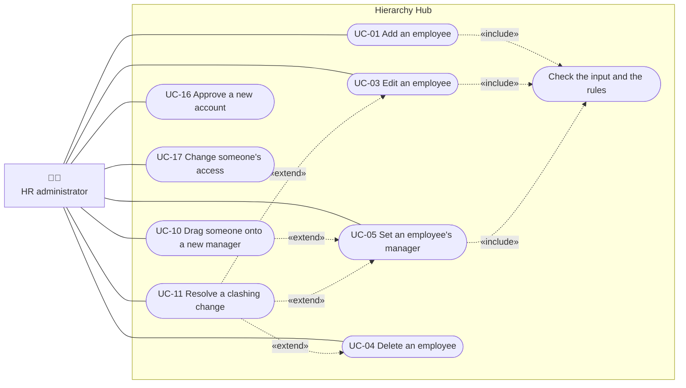
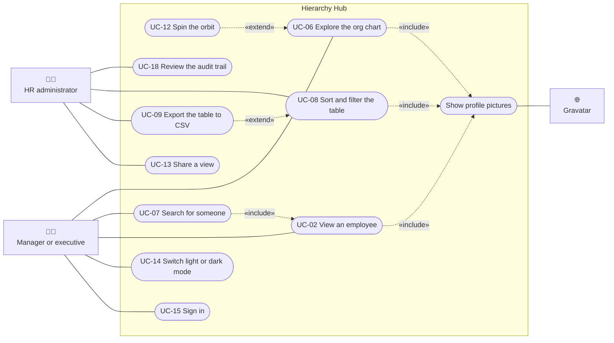
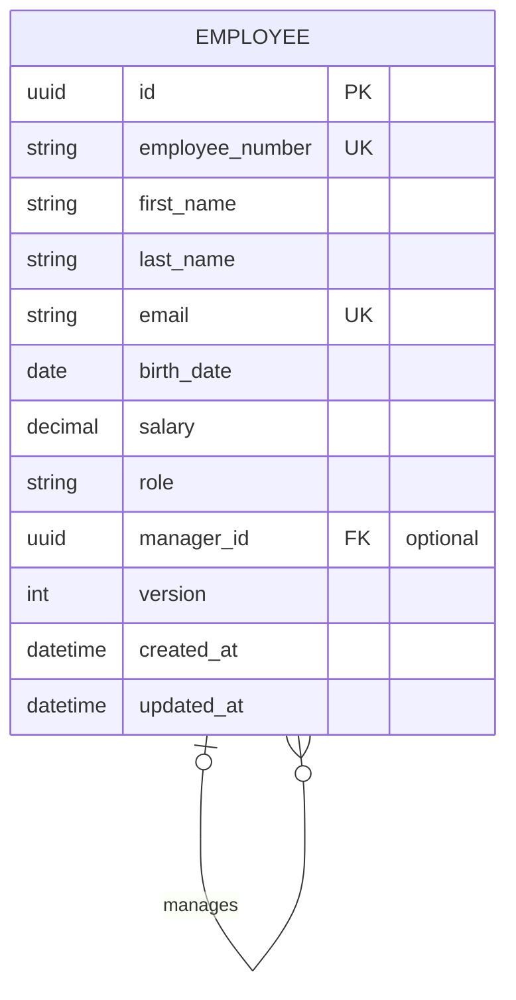

# Software Requirements Specification (SRS)

|         |                |
| ------- | -------------- |
| Project | Hierarchy Hub  |
| Client  | EPI-USE Africa |
| Version | 1.0            |
| Date    | October 2026   |

## 1. Introduction

### 1.1 Purpose

This document describes what Hierarchy Hub must do, and whether each requirement was built. It was used to plan the work, to build the system and to test it. Every requirement has an ID (for example `FR-05`) so it can be referenced in issues, pull requests and tests.

### 1.2 Scope

Hierarchy Hub is a web application that lets EPI-USE Africa manage its employees and their reporting lines. Users can:

- add, view, edit and delete employees
- set who each employee reports to
- see the organisation as a visual chart
- search, sort and filter employees in a table
- see each employee's profile picture from Gravatar

All data is stored in a cloud database. The app is hosted on AWS and opened through a public URL.

These are not part of this version: payroll, leave, multiple companies, and approval workflows.

### 1.3 Terms used

| Term               | Meaning                                                                                         |
| ------------------ | ----------------------------------------------------------------------------------------------- |
| Employee           | A person who works for the organisation. Each employee has one record.                          |
| Manager            | The employee that another employee reports to directly. Also called the reporting line manager. |
| Direct report      | An employee whose manager is a given person.                                                    |
| Top-level employee | An employee with no manager, such as the CEO.                                                   |
| Org chart          | A visual chart of who reports to whom.                                                          |
| Reporting loop     | When A reports to B (directly or further up) and B also reports to A. This must never happen.   |
| Gravatar           | A free service that links an email address to a profile picture.                                |

## 2. Overall description

### 2.1 System context

### 2.2 Users

| User                 | What they do                       | What they need                                               |
| -------------------- | ---------------------------------- | ------------------------------------------------------------ |
| HR administrator     | Keeps employee records up to date. | Quick forms, clear errors, a table they can sort and filter. |
| Manager or executive | Looks at team structures.          | A clear org chart and a fast search.                         |
| Assessor             | Reviews the solution.              | A working URL, a user guide, and clear technical documents.  |

Everyone signs in (FR-17). Anyone can ask for an account, and an admin above them approves it and links it to their employee record. Who can change whom follows the hierarchy (FR-25): you can only change people below you, and about yourself only your name and email.

### 2.3 Constraints

These come straight from the assessment brief.

| ID   | Constraint                                                                                            |
| ---- | ----------------------------------------------------------------------------------------------------- |
| C-01 | No mocked data. No hardcoded records or local data files. Every change is saved to a remote database. |
| C-02 | The code is kept in a git repository that the assessors can access.                                   |
| C-03 | The app is deployed to a cloud platform and opened through a URL.                                     |
| C-04 | Profile pictures come from Gravatar.                                                                  |
| C-05 | Every technology choice is explained in the technical document.                                       |

### 2.4 Assumptions

| ID   | Assumption                                                                                                                                           |
| ---- | ---------------------------------------------------------------------------------------------------------------------------------------------------- |
| A-01 | Every employee has a unique email address. The brief does not list email as a field, but Gravatar needs one to find a profile picture, so we add it. |
| A-02 | Employee numbers are given by the organisation and are unique. The system does not create them.                                                      |
| A-03 | Salaries are in South African rand (ZAR).                                                                                                            |
| A-04 | There can be more than one top-level employee, for example during a restructure.                                                                     |
| A-05 | The organisation has up to about 10,000 employees.                                                                                                   |

## 3. Use cases

### 3.1 Actors

| Actor                | Kind      | Goal                                                                                                      |
| -------------------- | --------- | --------------------------------------------------------------------------------------------------------- |
| HR administrator     | Primary   | Keep employee records and reporting lines correct.                                                        |
| Manager or executive | Primary   | Understand team structures and find people quickly.                                                       |
| Employee             | Secondary | Sets their own profile picture on Gravatar. They don't use Hierarchy Hub to do it.                        |
| Gravatar             | System    | Supplies profile pictures for email hashes.                                                               |
| PostgreSQL database  | System    | Stores every change and enforces the key rules. Inside the system boundary, shown for clarity in the SAS. |

Everyone signs in (FR-17). The two primary actors describe the two ways people use the app. What each person can change depends on whether they're an admin and where they sit in the organisation, not on which actor they are.

### 3.2 Use case diagram: managing employees

### 3.3 Use case diagram: exploring and reporting

How to read them: a solid line joins an actor to a use case they start. «include» means the use case always does the other one as part of it, for example adding an employee always checks the rules. «extend» means an optional extra path, for example dragging someone is another way of setting their manager.

### 3.4 Use case list

| ID    | Use case                        | Primary actor            | Requirements          |
| ----- | ------------------------------- | ------------------------ | --------------------- |
| UC-01 | Add an employee                 | HR administrator         | FR-01, FR-05, FR-06   |
| UC-02 | View an employee                | Manager or executive     | FR-02, FR-15          |
| UC-03 | Edit an employee                | HR administrator         | FR-03, FR-06          |
| UC-04 | Delete an employee              | HR administrator         | FR-04, BR-04          |
| UC-05 | Set an employee's manager       | HR administrator         | FR-05, BR-01 to BR-03 |
| UC-06 | Explore the org chart           | Manager or executive     | FR-07, FR-11          |
| UC-07 | Search for someone              | Manager or executive     | FR-08                 |
| UC-08 | Sort and filter the table       | HR administrator         | FR-09, FR-10, FR-13   |
| UC-09 | Export the table to CSV         | HR administrator         | FR-14                 |
| UC-10 | Drag someone onto a new manager | HR administrator         | FR-12                 |
| UC-11 | Resolve a clashing change       | HR administrator         | FR-22                 |
| UC-12 | Spin the orbit                  | Manager or executive     | FR-21                 |
| UC-13 | Share a view                    | Any user                 | FR-13                 |
| UC-14 | Switch light or dark mode       | Any user                 | FR-23                 |
| UC-15 | Sign in                         | Any user                 | FR-17                 |
| UC-16 | Approve a new account           | HR administrator (admin) | FR-24                 |
| UC-17 | Change someone's access         | HR administrator (admin) | FR-27                 |
| UC-18 | Review the audit trail          | HR administrator (admin) | FR-18                 |

### 3.5 Use case descriptions

#### UC-01 Add an employee

|                                 |                                                                                                                                                                                                                                   |
| ------------------------------- | --------------------------------------------------------------------------------------------------------------------------------------------------------------------------------------------------------------------------------- |
| Actor                           | HR administrator                                                                                                                                                                                                                  |
| Before                          | None.                                                                                                                                                                                                                             |
| Main steps                      | 1. The user selects **Add employee**. 2. They fill in every field and pick a manager, or "No manager". 3. They select **Add employee**. 4. The system checks and saves the employee. 5. The Explore page opens on the new person. |
| If a field is wrong             | A message appears under the field and the cursor moves to the first one to fix. Nothing is saved. (FR-06)                                                                                                                         |
| If the number or email is taken | The message appears under that field. (BR-05)                                                                                                                                                                                     |
| After                           | The employee is in the database and appears in the org chart and the table.                                                                                                                                                       |

#### UC-02 View an employee

|            |                                                                                                                                                                                                     |
| ---------- | --------------------------------------------------------------------------------------------------------------------------------------------------------------------------------------------------- |
| Actor      | Manager or executive                                                                                                                                                                                |
| Main steps | 1. The user opens someone from the org chart, a search result or the table. 2. The details panel shows their picture, every field, their manager, team counts and colleagues with the same manager. |
| After      | Nothing changes. The address bar holds the person, so the view can be shared (UC-13).                                                                                                               |

#### UC-03 Edit an employee

|                              |                                                                                                                                                                     |
| ---------------------------- | ------------------------------------------------------------------------------------------------------------------------------------------------------------------- |
| Actor                        | HR administrator                                                                                                                                                    |
| Before                       | The employee exists.                                                                                                                                                |
| Main steps                   | 1. The user opens the employee and selects **Edit details**. 2. They change any fields. 3. They select **Save changes**. 4. The system checks and saves the change. |
| If a field is wrong          | As in UC-01.                                                                                                                                                        |
| If someone else changed them | UC-11.                                                                                                                                                              |
| After                        | The change is saved and shown everywhere straight away.                                                                                                             |

#### UC-04 Delete an employee

|                              |                                                                                                                                                                                                                                                                                                                     |
| ---------------------------- | ------------------------------------------------------------------------------------------------------------------------------------------------------------------------------------------------------------------------------------------------------------------------------------------------------------------- |
| Actor                        | HR administrator                                                                                                                                                                                                                                                                                                    |
| Before                       | The employee exists.                                                                                                                                                                                                                                                                                                |
| Main steps                   | 1. The user opens the employee and selects **Delete**. 2. If the employee manages anyone, the system says how many people will move and who they will report to. 3. The user confirms. 4. The system deletes the employee and moves their direct reports up to the deleted employee's manager, in one step. (BR-04) |
| If they change their mind    | **Cancel** is selected by default, and closes without deleting anything.                                                                                                                                                                                                                                            |
| If someone else changed them | Nothing is deleted. UC-11.                                                                                                                                                                                                                                                                                          |
| After                        | The employee is gone, and nobody reports to them.                                                                                                                                                                                                                                                                   |

#### UC-05 Set an employee's manager

|                                   |                                                                                                                                                                                                                                                                                |
| --------------------------------- | ------------------------------------------------------------------------------------------------------------------------------------------------------------------------------------------------------------------------------------------------------------------------------ |
| Actor                             | HR administrator                                                                                                                                                                                                                                                               |
| Before                            | The employee exists.                                                                                                                                                                                                                                                           |
| Main steps                        | 1. The user opens the employee and selects **Change manager** (or **Edit details**). 2. They pick a manager from the **Reports to** list, or "No manager". 3. They save. 4. The system checks the change and saves it. 5. The org chart and table show the new reporting line. |
| If the user picks the same person | The person is greyed out in the list, so they can't be picked. If the API receives it anyway, it answers "An employee can't be their own manager" and nothing is saved. (BR-01)                                                                                                |
| If the change would create a loop | Everyone in the person's team is greyed out in the list. If the API receives it anyway, it answers "This person reports to the employee you're editing, so they can't be their manager" and nothing is saved. (BR-02)                                                          |
| Other ways                        | Drag and drop in the Orbit view (UC-10).                                                                                                                                                                                                                                       |
| If someone else changed them      | UC-11.                                                                                                                                                                                                                                                                         |
| After                             | Nobody manages themselves and there are no reporting loops.                                                                                                                                                                                                                    |

#### UC-06 Explore the org chart

|            |                                                                                                                                                                                                                                                                                                                                         |
| ---------- | --------------------------------------------------------------------------------------------------------------------------------------------------------------------------------------------------------------------------------------------------------------------------------------------------------------------------------------- |
| Actor      | Manager or executive                                                                                                                                                                                                                                                                                                                    |
| Main steps | 1. The user opens the Explore page, which starts at the top of the organisation. 2. The Orbit view shows the selected person, their manager above and their team circling them. 3. The user clicks anyone to move to them, or uses the path to the top to jump back up. 4. They can switch to the Levels view for one column per level. |
| Other ways | Spin the orbit (UC-12). On phones, the Orbit view becomes a stacked list.                                                                                                                                                                                                                                                               |
| After      | Nothing changes.                                                                                                                                                                                                                                                                                                                        |

#### UC-07 Search for someone

|                    |                                                                                                                                                                                                                                                                                               |
| ------------------ | --------------------------------------------------------------------------------------------------------------------------------------------------------------------------------------------------------------------------------------------------------------------------------------------- |
| Actor              | Manager or executive                                                                                                                                                                                                                                                                          |
| Main steps         | 1. The user types in **Find someone** (or presses / or Ctrl/Cmd + K). 2. Matching people appear as they type, searched by name, surname, email, employee number or role. 3. They pick one. 4. The person opens in the org chart (UC-02), where they can be edited (UC-03) or deleted (UC-04). |
| If nothing matches | The list says so.                                                                                                                                                                                                                                                                             |

#### UC-08 Sort and filter the table

|            |                                                                                                                                                                                                                                                      |
| ---------- | ---------------------------------------------------------------------------------------------------------------------------------------------------------------------------------------------------------------------------------------------------- |
| Actor      | HR administrator                                                                                                                                                                                                                                     |
| Main steps | 1. The user opens the People page. 2. They filter by role, salary, birth date or manager using the sentence, and search by name, email or employee number. 3. They click a column heading to sort, and again to reverse. 4. They move between pages. |
| After      | The filters, sort and page are in the address bar (UC-13).                                                                                                                                                                                           |

#### UC-09 Export the table to CSV

|            |                                                                                                                          |
| ---------- | ------------------------------------------------------------------------------------------------------------------------ |
| Actor      | HR administrator                                                                                                         |
| Before     | The table shows the people they want (UC-08).                                                                            |
| Main steps | 1. The user selects **Export CSV**. 2. The system downloads everyone who matches the filters, not just the current page. |

#### UC-10 Drag someone onto a new manager

|                           |                                                                                                                                                                                                                     |
| ------------------------- | ------------------------------------------------------------------------------------------------------------------------------------------------------------------------------------------------------------------- |
| Actor                     | HR administrator, with a mouse or pen                                                                                                                                                                               |
| Main steps                | 1. In the Orbit view, the user presses on a person and drags. 2. Allowed managers get a dashed outline, others fade. 3. They let go on the new manager. 4. They confirm with **Move**. 5. The rules of UC-05 apply. |
| If they change their mind | Escape while dragging, or **Cancel** in the confirmation. Nothing changes.                                                                                                                                          |

#### UC-11 Resolve a clashing change

|            |                                                                                                                                                                                                                                                 |
| ---------- | ----------------------------------------------------------------------------------------------------------------------------------------------------------------------------------------------------------------------------------------------- |
| Actor      | HR administrator                                                                                                                                                                                                                                |
| Before     | Someone else saved a change to the same employee after this user opened them.                                                                                                                                                                   |
| Main steps | 1. The user saves, deletes or drops. 2. The system refuses, because the employee has changed, and nothing is overwritten. 3. The user selects **Load the latest version** (or closes and checks the person again). 4. They repeat their change. |
| After      | Both people's changes are kept. (FR-22)                                                                                                                                                                                                         |

#### UC-12 Spin the orbit

|            |                                                                                                                                                                                                                            |
| ---------- | -------------------------------------------------------------------------------------------------------------------------------------------------------------------------------------------------------------------------- |
| Actor      | Manager or executive                                                                                                                                                                                                       |
| Main steps | 1. The user drags the empty space around the orbit, or swipes sideways on a touch screen. 2. The ring turns with them, and glides to a stop if flicked. 3. With the keyboard, tabbing to a person turns them to the front. |
| After      | Nothing changes in the data.                                                                                                                                                                                               |

#### UC-13 Share a view

|            |                                                                                                                                                                  |
| ---------- | ---------------------------------------------------------------------------------------------------------------------------------------------------------------- |
| Actor      | Any user                                                                                                                                                         |
| Main steps | 1. The user copies the address from the address bar. 2. Someone else opens it and sees the same person and view, or the same filtered, sorted page of the table. |

#### UC-14 Switch light or dark mode

|            |                                                                                                                |
| ---------- | -------------------------------------------------------------------------------------------------------------- |
| Actor      | Any user                                                                                                       |
| Main steps | 1. The user selects the round theme button in the top bar. 2. The app switches theme and remembers the choice. |

#### UC-15 Sign in

|                          |                                                                                                                                        |
| ------------------------ | -------------------------------------------------------------------------------------------------------------------------------------- |
| Actor                    | Any user                                                                                                                               |
| Before                   | They have an approved account. If not, they select **Ask for an account** and wait for UC-16.                                          |
| Main steps               | 1. The user enters their email and password. 2. The system checks them and starts a session. 3. They go on to the page they asked for. |
| If the details are wrong | The same message for a wrong email or a wrong password. Five wrong passwords lock the account for 15 minutes.                          |
| After                    | Signed in until they sign out, the session runs out, or an admin turns their account off.                                              |

#### UC-16 Approve a new account

|            |                                                                                                                                                                                                         |
| ---------- | ------------------------------------------------------------------------------------------------------------------------------------------------------------------------------------------------------- |
| Actor      | An admin                                                                                                                                                                                                |
| Main steps | 1. The admin opens **Accounts**. 2. For a waiting request, they choose the employee it belongs to, from the people below them who don't have an account yet. 3. They select **Approve**, or **Reject**. |
| After      | The person can sign in, and the approval is in the audit trail (UC-18).                                                                                                                                 |

#### UC-17 Change someone's access

|            |                                                                                                                                           |
| ---------- | ----------------------------------------------------------------------------------------------------------------------------------------- |
| Actor      | An admin                                                                                                                                  |
| Main steps | 1. The admin opens **Accounts**. 2. For someone below them, they select **Make admin**, **Remove admin**, **Turn off** or **Turn on**.    |
| After      | The change applies to the person's next request. Turning an account off signs them out straight away. Nobody can change their own access. |

#### UC-18 Review the audit trail

|            |                                                                                                                                                             |
| ---------- | ----------------------------------------------------------------------------------------------------------------------------------------------------------- |
| Actor      | An admin                                                                                                                                                    |
| Main steps | 1. The admin opens **Audit**, or **View history** on someone's details. 2. They read what happened, newest first, and narrow it by person or kind of event. |
| After      | Nothing changes. They only see events about people who were below them at the time, and about themselves.                                                   |

## 4. Functional requirements

Priority: **Must** is required by the brief. **Should** is expected for a good result. **Could** is an extra if time allows.

Status: **Built** means it works in the delivered app and has automated tests. **Not built** means it was an optional extra we chose not to do.

### 4.1 Employee management

| ID    | Requirement                                                                                                          | Priority | Status |
| ----- | -------------------------------------------------------------------------------------------------------------------- | -------- | ------ |
| FR-01 | Add an employee with first name, surname, birth date, employee number, salary, role, email, and an optional manager. | Must     | Built  |
| FR-02 | View an employee's details, including their manager and direct reports.                                              | Must     | Built  |
| FR-03 | Edit any of an employee's details.                                                                                   | Must     | Built  |
| FR-04 | Delete an employee after confirming.                                                                                 | Must     | Built  |
| FR-05 | Set, change or remove an employee's manager.                                                                         | Must     | Built  |
| FR-06 | Check input in the browser and on the server. Show a clear message next to each field that has a problem.            | Must     | Built  |

### 4.2 Org chart

| ID    | Requirement                                                                                                                                                                                                                               | Priority | Status |
| ----- | ----------------------------------------------------------------------------------------------------------------------------------------------------------------------------------------------------------------------------------------- | -------- | ------ |
| FR-07 | Show the hierarchy visually. Each person shows their name, role and profile picture, connected to their manager and their team. Built as two views, Orbit and Levels (ADR 0014).                                                          | Must     | Built  |
| FR-08 | Search the hierarchy by name, surname, employee number, email or role, from any page. Opening a result shows that person in the org chart, where they can be viewed, edited or deleted.                                                   | Must     | Built  |
| FR-11 | Find your way around large organisations: focus on one person, see the path to the top, see colleagues with the same manager, and switch between the Orbit and Levels views. This replaces the planned zoom, pan and collapse (ADR 0014). | Should   | Built  |
| FR-12 | Change a manager by dragging a person onto their new manager. The same rules as FR-05 apply.                                                                                                                                              | Could    | Built  |
| FR-21 | Show the Orbit view as a rotating 3D ring that can be spun by dragging, stops for hovering, dragging and keyboard use, and stays still for people who prefer less motion.                                                                 | Could    | Built  |

### 4.3 Employee table

| ID    | Requirement                                                                                                                                               | Priority | Status |
| ----- | --------------------------------------------------------------------------------------------------------------------------------------------------------- | -------- | ------ |
| FR-09 | Show all employees in a table with every field, the manager's name, and the profile picture.                                                              | Must     | Built  |
| FR-10 | Sort by any column, up or down. Filter by any field: text search for names, email and employee number; role; salary range; birth date range; and manager. | Must     | Built  |
| FR-13 | Load the table one page at a time. Keep sort and filter settings in the URL so a view can be bookmarked or shared.                                        | Should   | Built  |
| FR-14 | Export the current table view to a CSV file.                                                                                                              | Could    | Built  |

### 4.4 Profile pictures

| ID    | Requirement                                                                                                      | Priority | Status                                            |
| ----- | ---------------------------------------------------------------------------------------------------------------- | -------- | ------------------------------------------------- |
| FR-15 | Show each employee's Gravatar picture using their email address. If they have none, show their initials instead. | Must     | Built                                             |
| FR-16 | Let a user upload a picture that replaces the Gravatar picture.                                                  | Could    | Not built (see the technical document, section 9) |

### 4.5 Optional extras

| ID    | Requirement                                                                                                                                                                       | Priority | Status    |
| ----- | --------------------------------------------------------------------------------------------------------------------------------------------------------------------------------- | -------- | --------- |
| FR-17 | Sign in and out. Anyone can ask for an account, but it does nothing until an admin approves it and links it to an employee below them (ADR 0016).                                 | Could    | Built     |
| FR-18 | Keep a history of who changed what and when, with each field before and after, that nobody can change or delete (ADR 0018).                                                       | Could    | Built     |
| FR-19 | A dashboard with headcount by role and the size of each team.                                                                                                                     | Could    | Not built |
| FR-20 | Import employees from a CSV file into the database.                                                                                                                               | Could    | Not built |
| FR-22 | If two people change the same employee at the same time, refuse the second save instead of overwriting, and offer to load the latest version.                                     | Should   | Built     |
| FR-23 | Light and dark mode, remembered between visits.                                                                                                                                   | Could    | Built     |
| FR-24 | Admins approve or reject new accounts, and see the accounts of the people below them.                                                                                             | Should   | Built     |
| FR-25 | Who can change whom follows the hierarchy: people below you only, never yourself (beyond your name and email) or anyone above or beside you (ADR 0017).                           | Should   | Built     |
| FR-26 | Salaries and birth dates are only shown to the person and the people above them, and filters can't be used to guess them.                                                         | Should   | Built     |
| FR-27 | Admins make people below them admins, or turn their accounts off.                                                                                                                 | Should   | Built     |
| FR-28 | Flag salaries more than 25% away from what the person's position usually earns, and suggest a range when adding someone, learning only from salaries the user can see (ADR 0019). | Could    | Built     |
| FR-29 | Show the organisation as it was at any past moment, and replay its changes, rebuilt from the audit trail (ADR 0020).                                                              | Could    | Built     |

## 5. Business rules

| ID    | Rule                                                                                                                                                           | Where it is checked                       |
| ----- | -------------------------------------------------------------------------------------------------------------------------------------------------------------- | ----------------------------------------- |
| BR-01 | An employee cannot be their own manager.                                                                                                                       | Form, API and database (check constraint) |
| BR-02 | A manager change cannot create a reporting loop.                                                                                                               | Form, API and database (trigger)          |
| BR-03 | An employee can have no manager.                                                                                                                               | Database (manager is optional)            |
| BR-04 | When an employee with direct reports is deleted, those people move to the deleted employee's manager. If there is no manager, they become top-level employees. | API, in one transaction                   |
| BR-05 | Employee number and email must be unique.                                                                                                                      | Database and API                          |
| BR-06 | Salary cannot be negative and has at most two decimal places.                                                                                                  | Form, API and database                    |
| BR-07 | Employees must be at least 15 years old, the youngest anyone can be employed in South Africa. This also rules out birth dates in the future.                   | Form, API and database (trigger)          |

## 6. Data

### 6.1 Employee fields

| Field                  | Type                          | Required              | Rules                                                        |
| ---------------------- | ----------------------------- | --------------------- | ------------------------------------------------------------ |
| ID                     | UUID                          | Created by the system | Never changes.                                               |
| Employee number        | Text, up to 20 characters     | Yes                   | Unique. Letters, numbers and dashes only.                    |
| First name             | Text, up to 100 characters    | Yes                   | Cannot be blank.                                             |
| Surname                | Text, up to 100 characters    | Yes                   | Cannot be blank.                                             |
| Email                  | Text, up to 255 characters    | Yes                   | Valid email. Unique. Saved in lower case. Used for Gravatar. |
| Birth date             | Date                          | Yes                   | A real date, from 1900, at least 15 years ago.               |
| Salary                 | Number with 2 decimals        | Yes                   | 0 or more.                                                   |
| Role                   | Text, up to 100 characters    | Yes                   | The job title, for example "Software Engineer".              |
| Manager                | Reference to another employee | No                    | Must be an existing employee. See BR-01 and BR-02.           |
| Version                | Whole number                  | Set by the system     | Goes up by one on every change. Used by FR-22.               |
| Created at, Updated at | Date and time                 | Set by the system     |                                                              |

### 6.2 Data diagram

## 7. Non-functional requirements

Each requirement says what is needed, how the solution meets it, and how that is checked.

| ID     | Area             | Requirement                                                                                                                                                                                              | How it is met                                                                                                                                                                                                                      | How it is checked                                                                                                                                                                                                                                            |
| ------ | ---------------- | -------------------------------------------------------------------------------------------------------------------------------------------------------------------------------------------------------- | ---------------------------------------------------------------------------------------------------------------------------------------------------------------------------------------------------------------------------------- | ------------------------------------------------------------------------------------------------------------------------------------------------------------------------------------------------------------------------------------------------------------ |
| NFR-01 | Availability     | The app is online at its URL throughout the assessment.                                                                                                                                                  | Managed AWS services. `/api/health` lets the load balancer replace a broken container. `/api/health/ready` also checks the database.                                                                                               | Health checks are covered by end-to-end tests. Live checks after deployment.                                                                                                                                                                                 |
| NFR-02 | Speed            | A page of the table answers in under half a second, and the whole org chart in under a second, with 10,000 employees.                                                                                    | Indexes on every sortable and filterable column. The org chart loads in one request. Only one person's surroundings are drawn at a time (ADR 0014).                                                                                | End-to-end speed tests load 10,000 extra people and time both.                                                                                                                                                                                               |
| NFR-03 | Data safety      | Changes are saved in database transactions. Key rules are also enforced by the database. Two people can't silently overwrite each other.                                                                 | Transactions, constraints, a trigger with a lock, and a version check on every change (ADR 0010).                                                                                                                                  | Integration tests break each rule directly in the database. End-to-end tests fire two saves at once and check exactly one wins.                                                                                                                              |
| NFR-04 | Security         | HTTPS only. The database is not reachable from the internet. Secrets never go in git. The API only accepts requests from the app's own website. All input is checked on the server.                      | Private database network, Secrets Manager, CORS, Helmet headers, rate limits, a 16 KB body limit, strict input checks, and a database user that can only read and write rows (ADR 0010, ADR 0013).                                 | End-to-end security and rate limit tests. Dependabot for dependency updates.                                                                                                                                                                                 |
| NFR-05 | Privacy          | Email addresses are hashed before being sent to Gravatar. Salaries, birth dates and searches are never written to logs. Salaries and birth dates are only shown to the person and the people above them. | SHA-256 in the browser. Access logs hold the method, path, status, time and request ID only. The API hides other people's salaries and birth dates, and limits salary and birth date filters to the people you can see (ADR 0017). | Unit tests check the Gravatar link and that unexpected errors are logged without their message. The access log is built from the path only, never the query string (`request-id.ts`). Permission tests check what each position in the organisation can see. |
| NFR-06 | Ease of use      | Adding an employee, changing a manager and finding someone each take three clicks or fewer from the main screens. Error messages say how to fix the problem.                                             | **Add employee** and **Find someone** are in the top bar on every page. **Change manager** is in the details panel. Messages sit next to the field they're about.                                                                  | Screen tests follow each flow. The voice and tone rules are in the [brand guide](../design/BRAND.md).                                                                                                                                                        |
| NFR-07 | Accessibility    | Works with a keyboard, has visible focus, labelled fields and good colour contrast (WCAG 2.2 AA). The table is an accessible alternative to the chart.                                                   | Real buttons and form controls, focus management in dialogs, labels on every icon button, measured contrast of at least 5.2 to 1, and reduced motion support.                                                                      | Automated axe checks on every page, keyboard tests, and the contrast table in the brand guide.                                                                                                                                                               |
| NFR-08 | Screen sizes     | Works on screens from 360 pixels wide (phones) upwards.                                                                                                                                                  | Fluid layouts. The Orbit view becomes a stacked list on narrow screens.                                                                                                                                                            | Checked in the browser at phone, tablet and desktop widths.                                                                                                                                                                                                  |
| NFR-09 | Maintainability  | TypeScript everywhere, shared validation rules, and linting, type checks and tests on every pull request.                                                                                                | One monorepo with a shared package. A written decision record for every major choice.                                                                                                                                              | GitHub Actions runs formatting, lint, types, all tests and the build on every pull request.                                                                                                                                                                  |
| NFR-10 | Testing          | Business rules have unit tests. API endpoints have tests that run against a real PostgreSQL database.                                                                                                    | 522 automated tests across five suites (technical document, section 7).                                                                                                                                                            | The same CI run, with a real PostgreSQL service.                                                                                                                                                                                                             |
| NFR-11 | Repeatable setup | The API runs in a Docker container. Cloud resources are defined in code.                                                                                                                                 | The same database setup scripts run in Docker, in CI and on AWS. The AWS setup is written as code (ADR 0004).                                                                                                                      | CI builds the database from the scripts on every run. The cloud setup is checked during deployment.                                                                                                                                                          |
| NFR-12 | Cost             | Runs on the AWS free tier or for a few dollars a month.                                                                                                                                                  | The smallest sizes, no NAT gateway, and everything removed after the assessment.                                                                                                                                                   | AWS billing alerts, set up during deployment.                                                                                                                                                                                                                |

## 8. Checklist against the brief

Every line of the brief, and where Hierarchy Hub meets it.

| The brief says                                                                                  | How Hierarchy Hub meets it                                                                                                                                               | Requirements               |
| ----------------------------------------------------------------------------------------------- | ------------------------------------------------------------------------------------------------------------------------------------------------------------------------ | -------------------------- |
| A cloud hosted application                                                                      | Web app, API and database on AWS (ADR 0004).                                                                                                                             | C-03, NFR-01, NFR-11       |
| Create, read, update and delete employee data                                                   | Add employee button, details panel, Edit details and Delete.                                                                                                             | FR-01 to FR-04, FR-06      |
| Control the reporting structure by setting an employee's reporting line manager                 | Change manager, the Reports to field, or drag and drop in the Orbit view.                                                                                                | FR-05, FR-12, UC-05        |
| Employees may not be their own manager                                                          | Blocked in the form, the API and the database. Reporting loops are blocked too.                                                                                          | BR-01, BR-02               |
| An employee may have no manager (e.g. the CEO)                                                  | "No manager" in the Reports to list.                                                                                                                                     | BR-03                      |
| Name, surname, birth date, employee number, salary, role/position and reporting line manager    | All stored, plus email for Gravatar.                                                                                                                                     | Section 6.1, A-01          |
| A visual representation of the hierarchy (e.g. a tree or graph)                                 | The Explore page: a rotating 3D Orbit view and a Levels view.                                                                                                            | FR-07, FR-11, FR-21        |
| Search the hierarchy to find, edit or delete employee data                                      | Find someone in the top bar, on every page. Each result opens in the org chart with Edit details and Delete.                                                             | FR-08                      |
| A reporting table or list view, sortable and filterable on any of the employee data fields      | The People page: every column sorts both ways, and every field can be filtered. Also pages and CSV export.                                                               | FR-09, FR-10, FR-13, FR-14 |
| Gravatar integrated, so each employee has an avatar linked to their data                        | Pictures by email hash, with initials when there's no picture.                                                                                                           | FR-15, NFR-05              |
| Picture upload (optional nice-to-have)                                                          | Not built, by choice. Gravatar already manages pictures (technical document, section 9).                                                                                 | FR-16                      |
| Deployed to a cloud platform and reachable by a URL                                             | AWS, with the URL in the README and user guide.                                                                                                                          | C-03                       |
| A user guide                                                                                    | [User guide](../user-guide/USER_GUIDE.md), with screenshots.                                                                                                             |                            |
| A short technical document: architecture, design patterns, technologies and justification       | [Technical document](../technical/TECHNICAL.md), backed by the [SAS](../sas/SAS.md) and [ADRs](../adr/README.md).                                                        | C-05                       |
| No data mocked with hardcoded values or local files; all changes committed to a remote database | The app's only data source is the database. The production build has no mock code. Sample data can only be loaded into a local database (technical document, section 5). | C-01, NFR-03               |
| A git repository, accessible to the assessors                                                   | [github.com/Ayush-B99/hierarchyHub](https://github.com/Ayush-B99/hierarchyHub)                                                                                           | C-02                       |
| Any technology may be used, as long as it is justified                                          | Every choice is explained in the technical document and the ADRs.                                                                                                        | C-05                       |
| Additional functionality documented so it gets credit                                           | [Beyond the brief](../extras/EXTRAS.md) lists every extra with where to see it. Also the technical document (section 9) and the user guide (section 10).                 | FR-11 to FR-23             |
