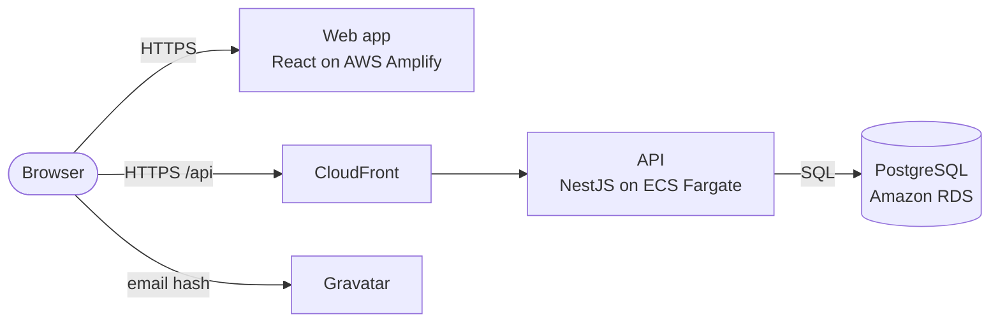

# Technical Document

|         |                                          |
| ------- | ---------------------------------------- |
| Project | Hierarchy Hub                            |
| Version | 0.1 (draft, finalised before submission) |
| Date    | October 2026                             |

This is the short technical document asked for in the brief. It explains the architecture, the design patterns, the technologies, and why we chose them. More detail is in the [SAS](../sas/SAS.md), the [SRS](../srs/SRS.md) and the [ADRs](../adr/README.md).

## 1. Architecture

Hierarchy Hub has three main parts: a web app, an API and a database. All three run on AWS.

- The **web app** shows the org chart, the employee table and the forms. It calls the API and loads profile pictures straight from Gravatar.
- The **API** holds all the business rules, such as "nobody manages themselves" and "no reporting loops". It is the only part that writes to the database.
- The **database** stores employees. Each employee points to their manager. The database also enforces key rules.
- A **shared package** holds the validation rules and types used by both the web app and the API.

## 2. Technologies

| Area              | Choice                                                     | Why                                                                                                     |
| ----------------- | ---------------------------------------------------------- | ------------------------------------------------------------------------------------------------------- |
| Language          | TypeScript                                                 | One language for the whole project. Types are shared, so many mistakes are caught before the code runs. |
| Web app           | React with Vite                                            | React has the best libraries for org charts and tables. Vite is fast and builds plain static files.     |
| Loading data      | TanStack Query                                             | Handles loading, caching and refreshing data after changes.                                             |
| Org chart         | React Flow                                                 | Zoom, pan, custom cards and drag and drop built in.                                                     |
| Table             | TanStack Table                                             | Full control over the look and accessibility.                                                           |
| API               | NestJS                                                     | Clear structure with modules, dependency injection and testing tools.                                   |
| Database access   | Prisma                                                     | Type-safe queries and versioned database changes (migrations).                                          |
| Validation        | Zod                                                        | One set of rules used in the browser and the API.                                                       |
| Database          | PostgreSQL                                                 | Enforces relationships and rules. Recursive queries for the hierarchy. Fast sorting and filtering.      |
| Hosting           | AWS Amplify, ECS Fargate, CloudFront, RDS, Secrets Manager | Managed services, HTTPS, private database, low cost.                                                    |
| Cloud setup       | AWS CDK                                                    | The whole AWS setup is written as code and can be rebuilt at any time.                                  |
| Code organisation | pnpm workspaces and Turborepo                              | One repository, shared code, fast cached builds.                                                        |
| Quality checks    | ESLint, Prettier, Jest, Vitest, GitHub Actions             | Every pull request is checked for formatting, lint errors, type errors and failing tests.               |

## 3. Design patterns

- **Layered architecture.** The API is split into controllers (HTTP), services (business rules) and repositories (database).
- **Modular monolith.** One API, split into feature modules.
- **Dependency injection.** NestJS gives each class what it needs, which makes testing easy.
- **Repository.** All database code sits in one place.
- **DTO and mapper.** The shape of API responses is separate from the database tables.
- **Shared kernel.** Types and validation rules live in one shared package.
- **Composite.** The org chart is a tree where every node is handled the same way.
- **Adapter.** Small wrappers around Gravatar and the API.
- **Unit of work.** Related database changes are saved together in one transaction.
- **Infrastructure as code.** The AWS setup is defined in TypeScript.

## 4. How the key rules are protected

| Rule                                                           | How                                                                                                                                     |
| -------------------------------------------------------------- | --------------------------------------------------------------------------------------------------------------------------------------- |
| Nobody manages themselves                                      | Checked in the form, in the API, and by the database.                                                                                   |
| No reporting loops                                             | Before a manager change, the API walks up the chain from the new manager. If it finds the employee being edited, it refuses the change. |
| The CEO has no manager                                         | The manager field is optional.                                                                                                          |
| Deleting a manager does not leave their team without a manager | Their direct reports move up to the deleted person's manager, in the same transaction.                                                  |
| No mocked data                                                 | The only data source is the PostgreSQL database on AWS. There are no hardcoded records or data files.                                   |

## 5. Why this approach

- **The data stays correct.** The database enforces the hierarchy rules even if the code has a bug.
- **One set of rules.** The web app and API share types and validation, so they cannot disagree.
- **Simple where it counts.** Changing a manager updates one row, and the whole org chart loads in one request.
- **Built like a real product, but cheap.** Managed AWS services, a private database, HTTPS and infrastructure as code, while keeping the monthly cost very low.
- **Easy to review.** A standard project layout, a record of every major decision, and automatic checks on every change.

## 6. Extra features

Features beyond the brief are listed in the [SRS, section 4.5](../srs/SRS.md#45-optional-extras). This section will list the ones that were built.
