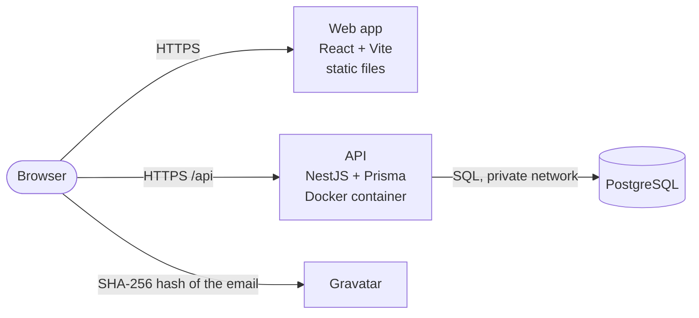
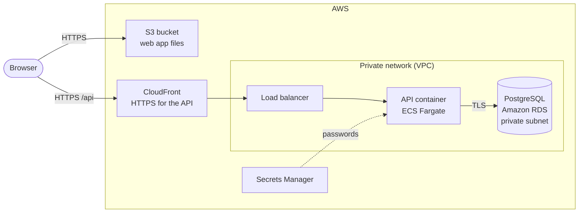
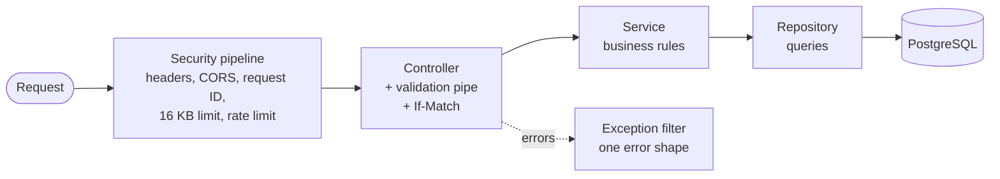

# Technical Document

|         |                |
| ------- | -------------- |
| Project | Hierarchy Hub  |
| Client  | EPI-USE Africa |
| Version | 1.0            |
| Date    | October 2026   |

This is the short technical document the brief asks for. It explains the architecture, the design patterns, the technologies, and why we think this is the best way to build the solution. Each section links to more detail in the [SAS](../sas/SAS.md), the [SRS](../srs/SRS.md) and the [Architecture Decision Records](../adr/README.md) (ADRs).

## 1. The solution in one paragraph

Hierarchy Hub is a web app for managing EPI-USE Africa's employees and who they report to. A React web app talks to a NestJS API over HTTPS, and the API stores everything in a PostgreSQL database. All three are written in TypeScript and share one package of types and validation rules, so the browser and the server always agree on what valid data looks like. The hierarchy's rules (nobody manages themselves, no reporting loops) are enforced at three levels: in the form, in the API and in the database itself.

## 2. Architecture

| Part           | What it does                                                                                                                                                    | Where it runs (ADR 0004, ADR 0021)                                        |
| -------------- | --------------------------------------------------------------------------------------------------------------------------------------------------------------- | ------------------------------------------------------------------------- |
| Web app        | The Explore page (org chart), the People page (table), the forms and search. Loads profile pictures straight from Gravatar.                                     | Amazon S3, served over HTTPS by CloudFront on the same address as the API |
| API            | The only way to read or change data. Checks every request, applies the business rules and talks to the database.                                                | A Docker container on AWS ECS Fargate, behind CloudFront for HTTPS        |
| Database       | Stores employees. Each employee points to their manager. Constraints and a trigger enforce the key rules even if the code has a bug.                            | Amazon RDS for PostgreSQL, in a private network                           |
| Shared package | Types, validation rules and hierarchy helpers used by both the web app and the API. Also holds the contract examples both sides are tested against (section 7). | Built into both, never deployed on its own                                |

Locally, the same API container and the same database setup scripts run through Docker, so development, CI and AWS all match. The live URL is added to the [README](../../README.md) and the [user guide](../user-guide/USER_GUIDE.md) once the deployment is complete.

### Deployment

The database sits in a private subnet with no internet access, so only the API can reach it. The full deployment diagram, the delivery pipeline and the three environments (local, CI and production) are in [SAS section 9](../sas/SAS.md#9-hosting-and-deployment).

### Inside the API

[SAS section 5](../sas/SAS.md#5-inside-the-api) shows every part of the pipeline.

### The hierarchy in the database

Each employee row has a `manager_id` pointing to another employee, or nothing for top-level people like the CEO. This is called an adjacency list (ADR 0003). We chose it because:

- changing someone's manager updates exactly one row
- PostgreSQL's recursive queries can walk up or down the chain when needed
- the database can enforce the rules on that one column

The web app loads the whole organisation in one request and builds the tree in memory. For 10,000 employees that is still a small download, and every view and count is then instant.

## 3. Technologies

| Area                | Choice                                             | Why we chose it                                                                                                                                                                 |
| ------------------- | -------------------------------------------------- | ------------------------------------------------------------------------------------------------------------------------------------------------------------------------------- |
| Language            | TypeScript, everywhere                             | One language for the browser, the server and the build. Types shared between them catch mistakes before the code runs.                                                          |
| Web app             | React 19 with Vite                                 | React is the most widely used UI library, with excellent testing tools. Vite starts instantly and builds plain static files that any host can serve.                            |
| Pages and links     | React Router                                       | The selected person, view, filters and sort live in the address bar, so the back button works and any view can be bookmarked or shared.                                         |
| Server data         | TanStack Query                                     | Handles loading, caching, retries and refreshing after changes, so screens never show stale data.                                                                               |
| Org chart and table | Built by hand (ADR 0014)                           | Focused views stay readable however big the organisation gets, and match the design exactly. The table sorts, filters and pages in the database, so no table library is needed. |
| 3D background       | Three.js                                           | The sculpted clay background (ADR 0009). It loads separately so the app is usable before it appears, and it pauses for people who prefer less motion.                           |
| API                 | NestJS                                             | A clear structure of modules, controllers and services, with dependency injection and good testing tools. Familiar to anyone who knows Spring or Angular.                       |
| Validation          | Zod                                                | One set of rules, written once in the shared package, used by the forms and by the API.                                                                                         |
| Database access     | Prisma, through our own node-postgres pool         | Type-safe queries, versioned migrations, and full control of connections and SSL (ADR 0012). Hand-written SQL where it is clearer, such as search and sorting by manager.       |
| Database            | PostgreSQL 16                                      | Enforces relationships, uniqueness and checks. Recursive queries for the hierarchy. Fast sorting and filtering with indexes.                                                    |
| Security            | Helmet, NestJS Throttler                           | Standard security headers and per-visitor rate limits (ADR 0013).                                                                                                               |
| Profile pictures    | Gravatar                                           | Required by the brief. Pictures are looked up by a hash of the email, built in the browser (ADR 0006).                                                                          |
| Hosting             | AWS: CloudFront, S3, ECS Fargate, RDS, as CDK code | Managed services with HTTPS, a private database and no servers to patch, at a low monthly cost (ADR 0004, ADR 0021).                                                            |
| Code organisation   | pnpm workspaces and Turborepo                      | One repository holding the web app, the API and the shared package. Builds and tests are cached, so only what changed is rebuilt (ADR 0001).                                    |
| Testing             | Vitest, Jest, Testing Library, Supertest, MSW, axe | Unit, integration, end-to-end and accessibility tests (section 7).                                                                                                              |
| Quality checks      | ESLint, Prettier, GitHub Actions, Dependabot       | Every pull request is checked for formatting, lint errors, type errors and failing tests, against a real database. Dependencies are kept up to date automatically.              |
| Documentation site  | MkDocs Material on GitHub Pages                    | All the docs as one searchable website, with diagrams rendered and light and dark mode, built from the same markdown files and published automatically (ADR 0015).              |

## 4. Design patterns

The patterns are in two groups: architectural patterns that shape the whole solution, and the classic Gang of Four (GoF) patterns from _Design Patterns_ (Gamma, Helm, Johnson and Vlissides) used inside the code. Every entry points to where it is used.

### 4.1 Architectural patterns

| Pattern                           | Where it is used                                                                                                                               | Why                                                                                               |
| --------------------------------- | ---------------------------------------------------------------------------------------------------------------------------------------------- | ------------------------------------------------------------------------------------------------- |
| Layered architecture              | API: controller (HTTP) → service (business rules) → repository (database), in `apps/api/src/employees`                                         | Each layer has one job and can be tested on its own.                                              |
| Modular monolith                  | API feature modules: `employees`, `health`, `database`                                                                                         | One simple deployment, with clear boundaries if it ever needs splitting up.                       |
| Dependency injection              | Every NestJS controller, service and repository                                                                                                | Tests swap in fakes without changing the code under test.                                         |
| Repository                        | `employees.repository.ts`                                                                                                                      | All database code in one place. The rest of the API never writes SQL.                             |
| DTO and mapper                    | `employee.mapper.ts` turns database rows into API responses                                                                                    | The API's shape doesn't change when the table does, and internal columns never leak out.          |
| Pipeline (pipes, guards, filters) | `ZodValidationPipe` checks input, `ThrottlerGuard` limits requests, `AllExceptionsFilter` turns every error into one consistent JSON shape     | Cross-cutting rules live in one place instead of in every endpoint.                               |
| Policy (shared permission rules)  | `packages/shared/src/permissions`, used by the API, the mock API and every screen                                                              | One definition of who can do what, so the buttons, the mock and the real API can't disagree.      |
| Shared kernel                     | `packages/shared`: types, Zod schemas and hierarchy helpers                                                                                    | The web app and API can't disagree about the rules.                                               |
| Optimistic concurrency            | Every employee has a `version`. The API sends it as an `ETag`, and every change must send it back in `If-Match`                                | If two people edit the same employee, the second save is refused instead of silently overwriting. |
| Unit of work (transactions)       | Deleting a manager moves their team up and deletes them in one locked transaction                                                              | Nobody can end up reporting to a deleted person.                                                  |
| Provider and custom hooks         | Dialogs and toasts are React context providers. Behaviour like dragging and spinning the orbit lives in hooks (`useOrbitDrag`, `useOrbitSpin`) | Logic is reusable and testable apart from the markup.                                             |
| URL as state                      | The selected person, view, filters, sort and page                                                                                              | Back button, bookmarks and shared links all just work.                                            |
| Contract testing                  | Shared examples in `packages/shared/src/testing` run against both the mock API and the real API                                                | The mock used by frontend tests can't drift away from the real API.                               |
| Infrastructure as code            | The AWS setup is described in code (ADR 0004, ADR 0021)                                                                                        | The cloud environment can be rebuilt or removed at any time.                                      |

### 4.2 Gang of Four patterns

#### Creational

| Pattern   | Where it is used                                                                                                                                                          | How                                                                                                                                                                                                         | Why                                                                                              |
| --------- | ------------------------------------------------------------------------------------------------------------------------------------------------------------------------- | ----------------------------------------------------------------------------------------------------------------------------------------------------------------------------------------------------------- | ------------------------------------------------------------------------------------------------ |
| Singleton | NestJS providers such as `DatabaseService` and `EmployeesService`                                                                                                         | NestJS creates one instance of each provider and hands the same one to everything that needs it. `DatabaseService` therefore owns the API's single connection pool.                                         | One pool for the whole API, so connections are shared instead of opened per request.             |
| Factory   | `createQueryClient()` in `lib/queryClient.ts`, `buildOrgIndex()` in `features/explore/orgIndex.ts`, and the `useFactory` provider for the rate limiter in `app.module.ts` | Functions that build a ready-to-use object from settings or data, so callers never assemble it themselves. Tests call the same factories to get fresh, isolated instances.                                  | Each test gets a clean query cache, and the rate limiter is built from validated settings.       |
| Builder   | `list()` in `employees.repository.ts`                                                                                                                                     | The list query is built step by step: each filter adds a `WHERE` part only if it was asked for, then the parts are joined, and the sort, null ordering and paging are added. Every value stays a parameter. | One method handles every combination of filters and sorts, safely, without string concatenation. |

#### Structural

| Pattern | Where it is used                                                     | How                                                                                                                                                                                                                                                                                   | Why                                                                                                        |
| ------- | -------------------------------------------------------------------- | ------------------------------------------------------------------------------------------------------------------------------------------------------------------------------------------------------------------------------------------------------------------------------------- | ---------------------------------------------------------------------------------------------------------- |
| Adapter | `PrismaPg` in `database.service.ts`, and `lib/gravatar.ts`           | `PrismaPg` adapts our own node-postgres pool to the interface Prisma expects (ADR 0012). `gravatar.ts` turns an email into the hashed URL Gravatar expects.                                                                                                                           | We keep full control of connections and SSL while still using Prisma, and screens never deal with hashing. |
| Facade  | The `api` object in `apps/web/src/lib/api.ts`, and `DatabaseService` | Screens call simple methods like `api.updateEmployee(id, changes, version)`. The facade hides URLs, JSON, headers, the `If-Match` version and turning error responses into `ApiError`. `DatabaseService` hides the pool, the adapter and start-up checks behind one injectable class. | The rest of the code stays simple, and HTTP or database details can change in one place.                   |

#### Behavioural

| Pattern                 | Where it is used                                                                                                                                               | How                                                                                                                                                                                                                                                               | Why                                                                                                                          |
| ----------------------- | -------------------------------------------------------------------------------------------------------------------------------------------------------------- | ----------------------------------------------------------------------------------------------------------------------------------------------------------------------------------------------------------------------------------------------------------------- | ---------------------------------------------------------------------------------------------------------------------------- |
| Chain of Responsibility | The API's request pipeline in `app.setup.ts` and `app.module.ts`                                                                                               | Each request passes along a chain: security headers, CORS, request ID, body parser, rate limit guard, validation pipe, then the controller. Any link can stop the request (for example a 413 or a 429) or pass it on. Errors go to the exception filter.          | Each concern is handled once, in order, and new checks can be added without touching the endpoints.                          |
| Template Method         | `AppThrottlerGuard` in `common/throttler.guard.ts`, and the lifecycle hooks in `DatabaseService`                                                               | `ThrottlerGuard` defines the rate limiting steps. Our subclass overrides one step, `throwThrottlingException`, to add the standard `Retry-After` header, then calls the original. `DatabaseService` fills in NestJS's `onModuleInit` and `onModuleDestroy` steps. | We fix one library behaviour without copying or rewriting the rest of it.                                                    |
| Strategy                | `ZodValidationPipe` in `common/zod-validation.pipe.ts`, the `SORT_SQL` table in `employees.repository.ts`, and the `retry` rule in `lib/queryClient.ts`        | One validation pipe is given a different schema for each input (list query, id, new employee, changes). The sort column is picked from a table of SQL expressions, one per sortable field. The query client is given a rule that decides when to retry.           | The algorithm can be swapped without changing the code that uses it. The sort table also means user input never becomes SQL. |
| Observer                | TanStack Query in `features/employees/queries.ts` and `mutations.ts`, the theme context, `usePrefersReducedMotion`, and the `ResizeObserver` in the Orbit view | Screens subscribe to query results. When a change is saved, the mutation invalidates the cache and every subscribed screen updates itself. Components also subscribe to the theme, the system's motion setting and the Orbit's width.                             | The org chart, table and details panel all stay in step after any change, without calling each other.                        |
| Mediator                | `EmployeeDialogsProvider` in `features/employees`                                                                                                              | The top bar and the details panel ask the provider to `openAdd`, `openEdit` or `openDelete`. The provider decides which dialog is open and owns its state.                                                                                                        | Buttons don't need to know about the dialogs, and two dialogs can never be open at once.                                     |

Patterns from the book we did not need include Abstract Factory, Prototype, Bridge, Composite, Decorator, Flyweight, Proxy, Command, Interpreter, Iterator, Memento, State and Visitor. NestJS's `@Controller` and `@Injectable` are TypeScript decorators (labels read by the framework), not the GoF Decorator pattern.

## 5. How the rules are protected

| Rule                                                                                  | Form                              | API                                           | Database                                                                   |
| ------------------------------------------------------------------------------------- | --------------------------------- | --------------------------------------------- | -------------------------------------------------------------------------- |
| Nobody manages themselves (BR-01)                                                     | Yes                               | Yes                                           | Check constraint                                                           |
| No reporting loops (BR-02)                                                            | Yes                               | Yes                                           | Trigger, with a lock so changes queue safely                               |
| Someone can have no manager, like the CEO (BR-03)                                     | Yes                               | Yes                                           | The manager column is optional                                             |
| Deleting a manager moves their team up to the next manager (BR-04)                    | Explains who moves                | Yes, in one transaction                       | Foreign key stops anyone pointing at a deleted person                      |
| Employee number and email are unique (BR-05)                                          | Shows the error on the field      | Yes                                           | Unique indexes                                                             |
| Salary is not negative (BR-06)                                                        | Yes                               | Yes                                           | Check constraint                                                           |
| Employees are at least 15 years old (BR-07)                                           | Yes                               | Yes                                           | Trigger                                                                    |
| You only change people below you, and only your name and email about yourself (FR-25) | Only shows what you can do        | Checked under the reporting lines lock        | The same lock the loop trigger uses                                        |
| Salaries and birth dates only for the person and those above them (FR-26)             | Shows **Private**                 | Hidden and left out of filters                |                                                                            |
| Every change is recorded and the record can't be changed (FR-18)                      |                                   | Written in the same transaction as the change | The API's user can only add and read. A trigger blocks updates and deletes |
| Two people don't overwrite each other's changes                                       | Offers to load the latest version | Version check on every change                 | Version column                                                             |

The form gives instant, friendly feedback. The API is the real gatekeeper. The database is the last line of defence, so the data stays correct even if a bug slips through the code.

### No mocked data

The brief says no data may be mocked using hardcoded values or local files, and that every change must be saved to a remote database. In Hierarchy Hub:

- the deployed app has one data source: the PostgreSQL database, through the API
- the production build contains no mock code and no sample data (it is removed at build time)
- a mock API exists only for automated frontend tests and optional local design work (ADR 0008), and is checked against the real API by the contract tests
- sample people can be loaded into a database on a developer's own machine (`task db:seed`), but the seed script refuses to run against any database that isn't local, so sample data can never reach the live database

## 6. Security

Everyone signs in (ADR 0016), and the API protects itself in several more ways (ADR 0013):

- HTTPS only, and the database is not reachable from the internet
- sessions in the database with an `httpOnly`, same-site cookie. Only a hash of the cookie is stored, and every request checks the account, so signing out or turning an account off works straight away
- passwords hashed with Argon2id, five wrong guesses lock the account for 15 minutes, and neither the errors nor the timing reveal which emails have accounts
- new accounts do nothing until an admin above the person approves them
- what you can change follows the hierarchy: people below you only, never yourself beyond your name and email, never anyone above or beside you (ADR 0017)
- salaries and birth dates are hidden by the API from everyone but the person and those above them, and salary filters only look at people you can see
- reads are `Cache-Control: private` with `Vary: Cookie`, so caches never mix up two people's views
- every change, sign in and access change is written to an append only audit trail in the same transaction. The API can't edit or delete it, and a trigger stops anyone else (ADR 0018)
- changes sent from other websites are refused, on top of the same-site cookie
- two database users: the API's user can only read and write rows, and only a separate migration user can change the tables (ADR 0010)
- security headers, and the API only accepts calls from the web app's own address (CORS)
- rate limits per visitor, with a separate, lower limit for changes
- request bodies limited to 16 KB, and strict input checks that reject unknown fields
- every response has a request ID, and logs never include salaries, birth dates, request bodies or database error text
- emails are hashed in the browser before being sent to Gravatar

## 7. Testing

| Kind                 | What it covers                                                                                             | Tool                                       | Count |
| -------------------- | ---------------------------------------------------------------------------------------------------------- | ------------------------------------------ | ----- |
| Shared unit tests    | Validation rules and hierarchy helpers                                                                     | Vitest                                     | 61    |
| Web tests            | Screens, forms, search, drag and drop, the orbit, clashes, accessibility (axe), CSV export                 | Vitest, Testing Library, MSW               | 174   |
| API unit tests       | Services, mappers, settings, error handling, version checks, the seed guard                                | Jest                                       | 37    |
| Database integration | Constraints, the loop trigger, clashing changes made at the same moment                                    | Jest against real PostgreSQL               | 37    |
| API end to end       | Every endpoint and rule over HTTP, clashing saves, security headers, rate limits, speed with 10,000 people | Jest and Supertest against real PostgreSQL | 213   |
| Infrastructure       | No NAT gateway, private encrypted database, API only through CloudFront, secrets only where needed         | Vitest and CDK assertions                  | 11    |

All of these run on every pull request in GitHub Actions, together with formatting, linting, type checks and the build. The end-to-end tests can only ever run against a database whose name ends in `_test`.

## 8. Why this is the best way to build it

- **The data stays correct.** The rules live in the database as well as the code. A bug in the app can't create a reporting loop or a person who manages themselves.
- **One set of rules.** The web app and API share types and validation, so they can't disagree, and the contract tests prove the mock and the real API behave the same.
- **Simple where it counts.** Changing a manager updates one row. The org chart loads in one request. One API, one database.
- **Easy to use at any size.** Focused org chart views stay readable for 10 people or 10,000, and the table sorts and filters in the database.
- **Safe for more than one user.** Version checks stop two people silently overwriting each other's work.
- **Built like a real product, at low cost.** Managed AWS services, a private database, HTTPS, security headers and rate limits, automated checks on every change, and a written record of every major decision.

## 9. Features beyond the brief

The brief invites extra functionality. These were built, and each is explained in the [user guide](../user-guide/USER_GUIDE.md). [Beyond the brief](../extras/EXTRAS.md) lists every extra, including the engineering, security and testing work, with where to see each one:

| Feature                                                                                           | Requirement           |
| ------------------------------------------------------------------------------------------------- | --------------------- |
| A rotating 3D Orbit view, with drag to spin, and moons showing each person's team size            | FR-21                 |
| A Levels view, a path to the top, and "Works alongside" for colleagues with the same manager      | FR-11                 |
| Change a manager by dragging a person onto their new manager                                      | FR-12                 |
| Search from any page, with keyboard shortcuts                                                     | FR-08                 |
| Table filters written as a sentence, and paging                                                   | FR-10, FR-13          |
| Export the filtered table to CSV                                                                  | FR-14                 |
| Shareable links for any person or filtered view                                                   | FR-13                 |
| Protection against two people overwriting each other's changes                                    | FR-22                 |
| Light and dark mode, phone and tablet layouts, keyboard and screen reader support, reduced motion | FR-23, NFR-07, NFR-08 |
| Sign in, with new accounts approved by an admin above the person                                  | FR-17, FR-24          |
| Permissions that follow the hierarchy, and salaries private to the person and those above them    | FR-25 to FR-27        |
| An audit trail of every change that nobody can edit, with an Audit page for admins                | FR-18                 |
| A pay check: a least squares regression that flags salaries out of line and suggests ranges       | FR-28                 |
| Time travel: the organisation at any past moment, rebuilt from the audit trail                    | FR-29                 |
| Every attack we tried kept as an automated test ([security testing](../security/ATTACKS.md))      | NFR-04                |

### Picture upload

The brief lists picture upload as an optional nice-to-have (FR-16). We chose not to build it. Gravatar already lets each employee manage their own picture in one place, and storing uploads would add file storage, image checks and extra privacy rules to the system. The user guide explains how an employee sets or changes their picture on Gravatar.
