# User Guide

This guide shows how to use Hierarchy Hub to manage EPI-USE Africa's employees and who they report to. The screenshots use sample employees.

Live app: [d6atm0gw3zjf0.cloudfront.net](https://d6atm0gw3zjf0.cloudfront.net)

## 1. Getting started

### Signing in

Open the app in a current browser, at **https://d6atm0gw3zjf0.cloudfront.net**, and sign in with your work email and password. Your name appears in the top bar, with an **Admin** badge if you're an admin. Select **Sign out** there when you're done.

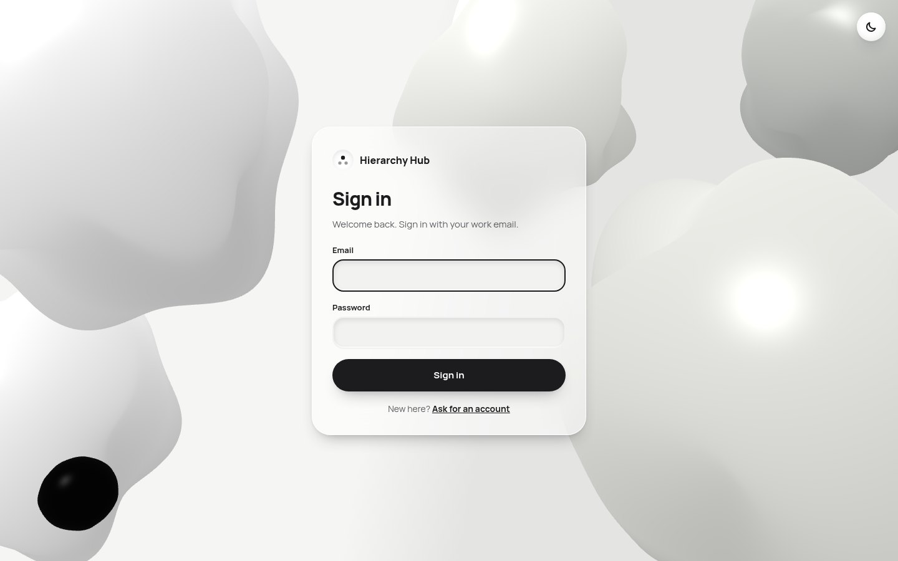

If you type the wrong password five times in a row, your account is locked for 15 minutes, even for the right password. This stops anyone guessing it.

### Asking for an account

If you don't have an account yet, select **Ask for an account** on the sign in page. Enter your full name, your work email and a password of at least 12 characters. A few words you'll remember works well, for example `river lamp autumn tea`.

Your account does nothing until an admin approves it and links it to your employee record. You'll get the same message whatever you enter, so nobody can use this page to find out who has an account. Once you're approved, sign in as normal.

### Finding your way around

There are two main pages, which you switch between with the tabs in the top bar:

- **Explore** shows the organisation one person at a time.
- **People** lists everyone in a table.

The round button on the right of the top bar switches between light and dark mode. The app remembers your choice.

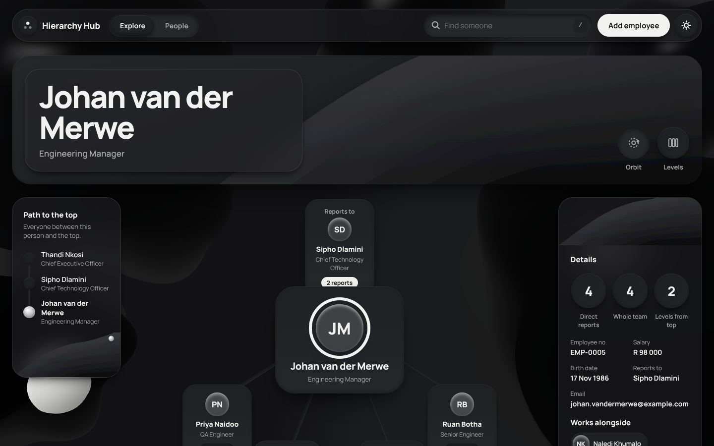

## 2. Adding an employee

1. Select **Add employee** in the top bar.
2. Fill in the first name, surname, email, employee number, birth date, role and salary. Every field is needed.
3. Under **Reports to**, pick their manager. Leave it as **No manager** only for someone at the very top, like the CEO.
4. Select **Add employee**.

If something is missing or doesn't look right, a short message appears under that field and the cursor jumps to the first one to fix. Employee numbers and email addresses must be unique, so you'll be told if someone already has them.

When the employee is saved, a confirmation appears at the bottom of the screen and the Explore page opens on the new person, so you can see where they sit.

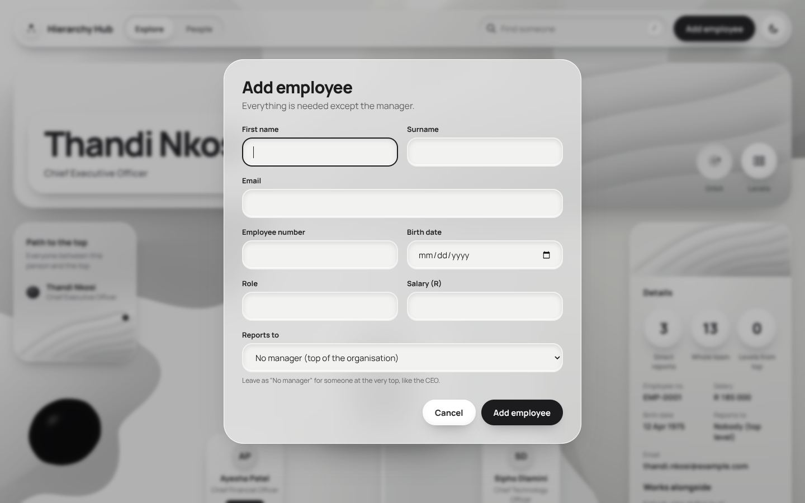

## 3. Viewing and editing an employee

Open someone on the Explore page (or click their name on the People page) to see all their details in the panel on the right.

To change anything, select **Edit details**, update the fields and select **Save changes**. Press **Cancel** or the Escape key to close without saving.

### If someone else changed them first

Several people can use Hierarchy Hub at the same time. If someone else saves a change to the same employee while you have the form open, your save is stopped so their work isn't overwritten. You'll see a message like "Someone else changed Johan while you were editing, so your changes weren't saved".

1. Select **Load the latest version**. The form fills in with their changes.
2. Make your change again and select **Save changes**.

The same check protects deleting and dragging. If the person changed since you opened the dialog, nothing is deleted or moved, and you're asked to check their latest details first.

## 4. Changing someone's manager

Open the person on the Explore page and select **Change manager**. The form opens with **Reports to** ready to change.

Some people are greyed out in the list and can't be picked:

- the person themselves, because nobody can be their own manager
- anyone in their team, at any level below them, because that would create a reporting loop

Pick the new manager and select **Save changes**. The org chart updates straight away.

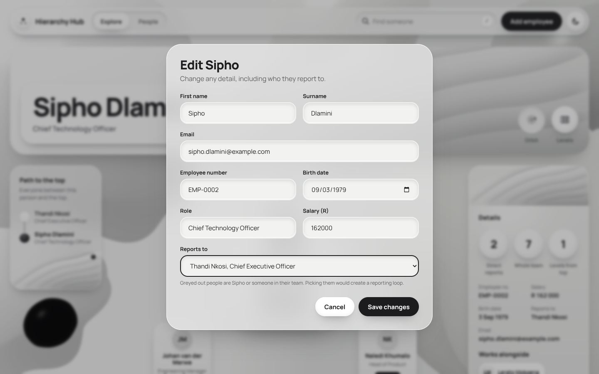

### Dragging instead

With a mouse, you can also drag someone in the Orbit view onto their new manager:

1. Press and hold on a person's card and start moving. The orbit stops turning while you drag.
2. Cards you can drop on get a dashed outline. Cards you can't (the person's own team, or their current manager) fade out.
3. Let go over the new manager. The card under the pointer gets a solid outline and the label says "Move ... here".
4. Confirm with **Move**, or press **Cancel**. Nothing changes until you confirm.

Press Escape while dragging to stop. On touch screens, use **Change manager** instead, so swiping still scrolls the page.

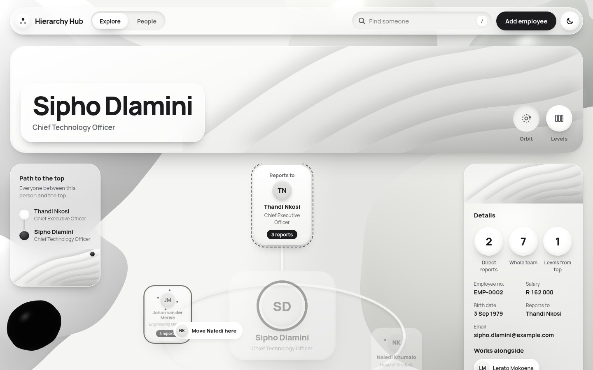

## 5. Deleting an employee

Open the person on the Explore page and select **Delete**.

Before anything happens, a message tells you exactly who will be affected. For example: "4 people report to Johan. They'll move to Sipho Dlamini." The people who reported to the deleted employee move up to the deleted employee's own manager, so nobody is left without one.

Select **Delete employee** to confirm, or **Cancel** to keep them. **Cancel** is selected by default so a stray key press can't delete anyone. This can't be undone.

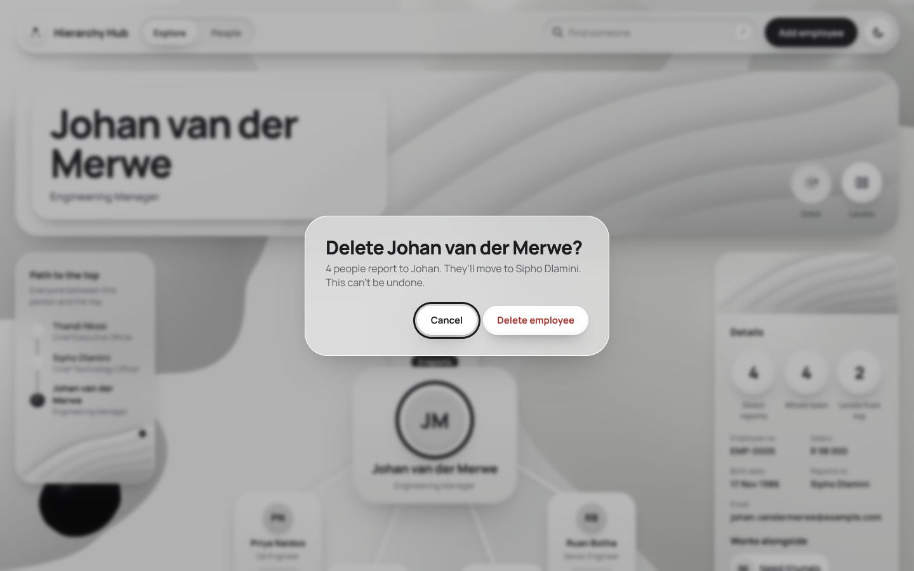

## 6. Exploring the organisation

The Explore page always focuses on one person. When you first open it, that's the person at the top of the organisation, usually the CEO.

### Orbit view

The Orbit view works like a small solar system. The selected person sits in the middle, their manager is above them, and the people who report to them circle slowly around them on a tilted ring. People at the front of the ring look bigger and brighter. People at the back look smaller and pass behind the person in the middle.

- **Click anyone** to move to them. They become the person in the middle.
- **Spin the ring yourself** by dragging the empty space around it, left or right. Let go with a flick and it glides on before settling back to its own pace. On a touch screen, swipe sideways across it.
- The ring stops while your pointer is over someone, so you're never clicking a moving card. It also stops while you drag someone or confirm a move.
- With the keyboard, press Tab to go from person to person. The ring turns until the person you're on faces you.
- Each card shows how many people report to that person, or "No team". People with a team also have small moons circling their picture, one for each person in their team (up to six).
- If someone has a very large team, the last card says **+N more**. Click it to see everyone in the Levels view.

If you've asked your device for less motion (for example "Reduce motion" on a Mac or iPhone, or "Show animations" turned off in Windows), the ring stays still. You can still drag it round. On narrow screens such as phones, the Orbit view shows the manager, the person and their team stacked in a list instead.

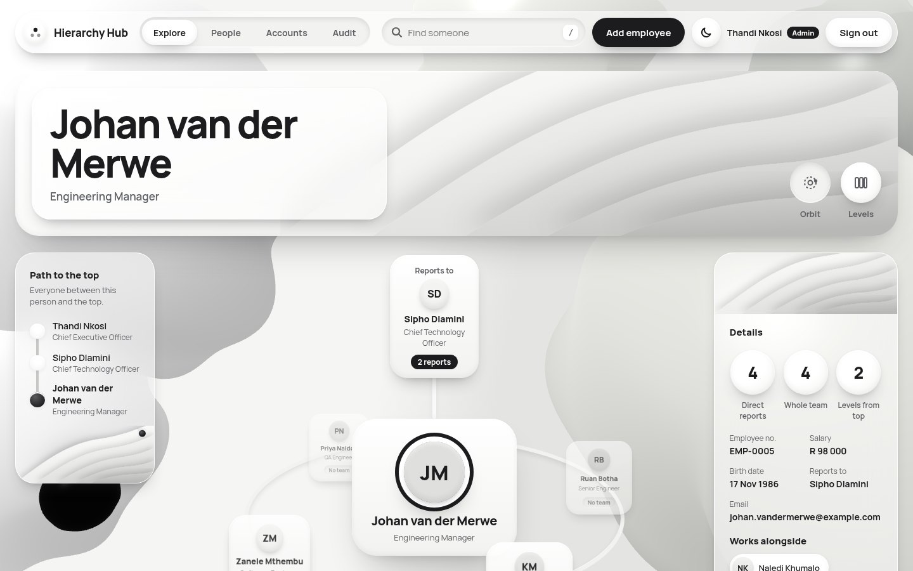

### Levels view

Click the **Levels** button in the top card to switch views. Each column is one level of the organisation, starting with the top. The columns follow the path down to the selected person, who is highlighted. Click anyone to select them and open their team in the next column.

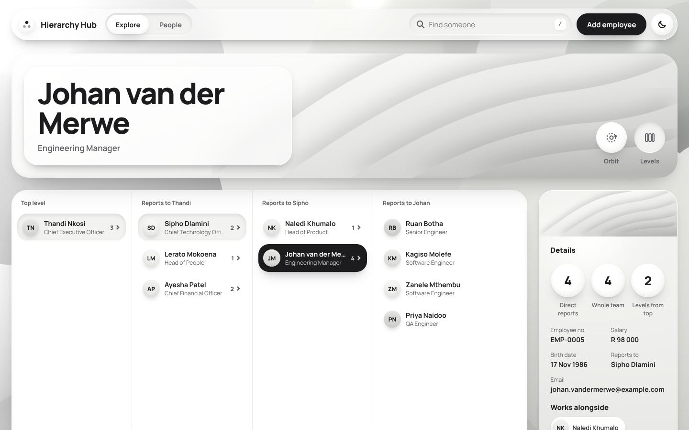

### Path to the top

In the Orbit view, the panel on the left lists everyone between the selected person and the top of the organisation. Click any of them to jump straight there.

### Details

The panel on the right shows the selected person's details:

- three numbers: their direct reports, everyone in their whole team, and how many levels they are below the top
- their employee number, salary, birth date, manager and email
- **Works alongside**: other people with the same manager. Click one to jump to them.

The **Edit details**, **Change manager** and **Delete** buttons at the bottom of this panel are explained in sections 3 to 5.

### Finding someone

Use the **Find someone** box in the top bar, on any page. Type part of a name, employee number, email or role and matching people appear as you type, with the matching letters underlined.

- Click a person, or use the arrow keys and press Enter, to open them.
- Press **/** (or **Cmd + K** on a Mac, **Ctrl + K** on Windows) from anywhere to jump to the search box.
- Press Escape to clear the search.

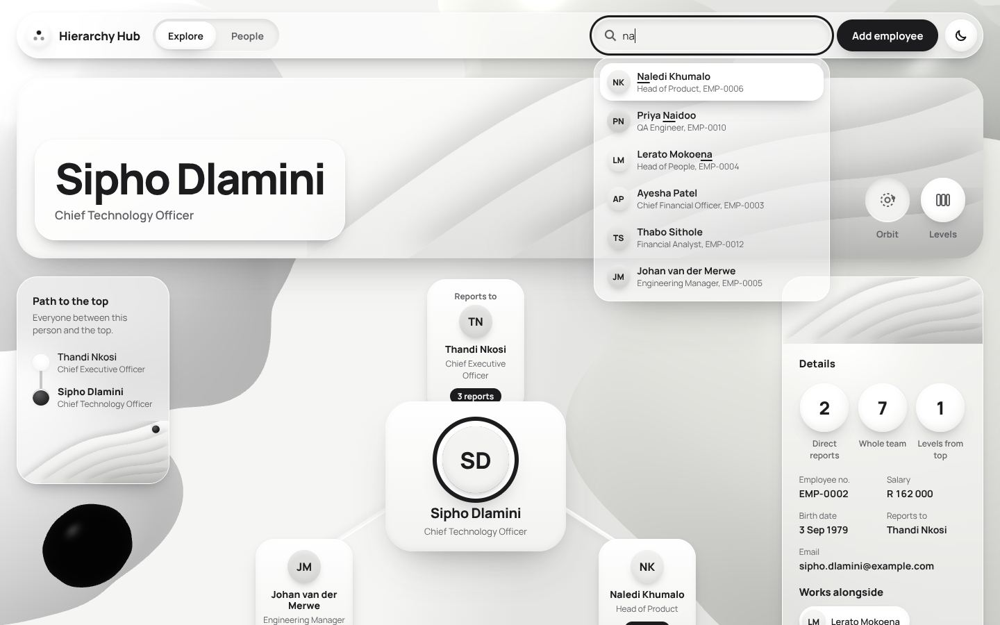

### Sharing and going back

The selected person and view are saved in the address bar, so:

- the browser's back button takes you to the person you were looking at before
- you can copy the address and send it to someone to show them a specific person

## 7. Using the People page

The People page lists everyone in a table, 10 people at a time.

### Filtering with the sentence

At the top is a sentence: _Show people in **any role**, earning **any salary**, born **in any year** and reporting to **anyone**._

Each word in a pill is a dropdown. Click one and pick an option to filter the table, for example "Software Engineer" or "over R 50 000". Pills that are filtering the table turn solid so you can see what's applied. **Clear filters** puts everything back.

### Searching

Type in the search box to find people by name, surname, email or employee number. The table updates as you type.

### Sorting

Click any column heading to sort by it. Click it again to reverse the order. The arrow next to the heading shows which column is sorted and in which direction. **Reports to** sorts by the manager's surname, with people who have no manager first.

### Pages

Below the table you'll see how many people match, for example "Showing 1 to 10 of 14 people". Use **Previous** and **Next** to move between pages.

### Opening someone

Click a person's name, or anywhere on their row, to open them on the Explore page.

### Exporting

**Export CSV** downloads everyone who matches the current filters, not just the page you can see. The file opens in Excel, Google Sheets or Numbers.

### Sharing a view

Your filters, sort and page are saved in the address bar. Copy the address to bookmark a view or send it to someone.

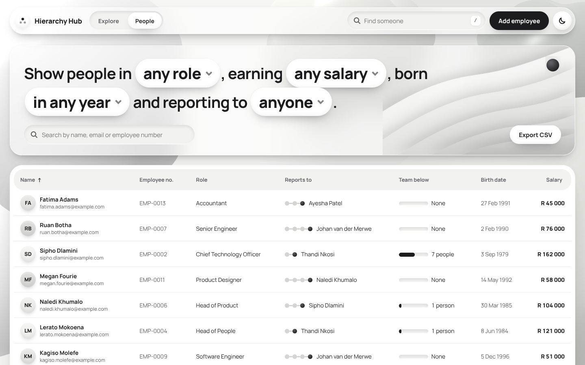

## 8. Profile pictures

Profile pictures come from [Gravatar](https://gravatar.com), a free service that links a picture to an email address. Hierarchy Hub looks up each employee's picture using the email in their record.

- If the employee has a Gravatar picture, it shows on their cards, in the table and in search results.
- If they don't, a soft circle with their initials is shown instead.

To change a picture, the employee signs in to gravatar.com with the same email address and uploads a new one. It appears in Hierarchy Hub automatically, usually within a few minutes. If you change an employee's email in Hierarchy Hub, their picture changes to the one linked to the new address.

For privacy, the email address is turned into a code (a hash) in your browser before it's sent to Gravatar, so Gravatar never sees the address itself.

## 9. Troubleshooting

| What you see                                                  | What to do                                                                                                                       |
| ------------------------------------------------------------- | -------------------------------------------------------------------------------------------------------------------------------- |
| "We couldn't load the organisation"                           | Check your connection and select **Try again**.                                                                                  |
| "Another employee already has that email or employee number"  | Use a different value, or search for the existing person and edit them instead.                                                  |
| A person is greyed out in **Reports to**                      | They're the person you're editing or in their team. Picking them would create a reporting loop.                                  |
| A picture shows initials instead of a photo                   | That email has no Gravatar picture yet. See section 8.                                                                           |
| "We couldn't find that person"                                | The link points to someone who has been deleted. You're shown the top of the organisation instead.                               |
| "Someone else changed ... while you were editing"             | Select **Load the latest version**, then make your change again. See section 3.                                                  |
| The Orbit view isn't turning                                  | It stops while your pointer is over a card. If it never turns, your device is set to reduce motion. You can still drag it round. |
| "Email or password is wrong"                                  | Check both. For your safety, the app doesn't say which one is wrong.                                                             |
| "Your account is waiting for an admin to approve it"          | An admin hasn't linked your account to your employee record yet. Ask your manager.                                               |
| "Too many wrong passwords"                                    | Wait the number of minutes shown, then try again.                                                                                |
| A salary or birth date says **Private**                       | Only the person and the people above them can see these. See section 12.                                                         |
| Sorting by salary leaves people out                           | Salary and birth date filters and sorting only include you and the people below you. See section 12.                             |
| You're sent back to the sign in page                          | Your session ended: you signed out elsewhere, it ran out, or an admin turned your account off. Sign in again.                    |
| There's no **Edit details**, **Change manager** or **Delete** | You can only change people below you, and about yourself only your name and email. See section 12.                               |

## 10. Extra features

These go beyond what the brief asked for. [Beyond the brief](../extras/EXTRAS.md) has the full list, including the work behind the scenes.

| Feature                                                          | Where                         |
| ---------------------------------------------------------------- | ----------------------------- |
| Two ways to explore: Orbit and Levels                            | Explore page, section 6       |
| A rotating 3D Orbit you can spin, with moons for team size       | Explore page, section 6       |
| Sign in, with new accounts approved by an admin                  | Sections 1 and 11             |
| Permissions that follow the organisation, and private salaries   | Section 12                    |
| A history of who changed what, that can't be edited              | Section 13                    |
| A pay check that spots salaries out of line, and suggests ranges | Section 14                    |
| Time travel: see and replay the organisation at any past moment  | Section 15                    |
| Path to the top and "Works alongside"                            | Explore page, section 6       |
| Drag a person onto a new manager                                 | Orbit view, section 4         |
| Search from any page, with keyboard shortcuts                    | Top bar, section 6            |
| Filters written as a sentence                                    | People page, section 7        |
| Export to CSV                                                    | People page, section 7        |
| Shareable links for any person or filtered view                  | Address bar, sections 6 and 7 |
| Protection against overwriting someone else's changes            | Forms and dialogs, section 3  |
| Light and dark mode                                              | Top bar, section 1            |
| Works on phones and tablets                                      | Everywhere                    |
| Keyboard and screen reader support                               | Everywhere                    |
| Respects your device's reduced motion setting                    | Everywhere                    |

## 11. Approving accounts (admins)

Admins see an **Accounts** tab in the top bar. It has two parts.

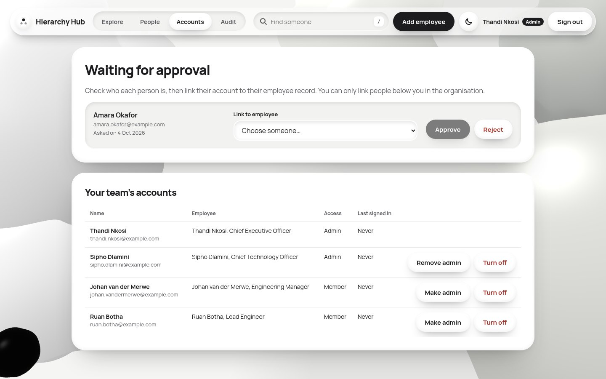

**Waiting for approval** lists everyone who has asked for an account. For each person:

1. Check who they are, for example by asking their manager.
2. In **Link to employee**, choose their employee record. Only people below you who don't have an account yet are listed, because you can only approve accounts for your own part of the organisation. If their email matches an employee's, that person is chosen for you.
3. If the email they signed up with doesn't match the employee you chose, a note says so. Make sure it's really them before going on.
4. Select **Approve**. They can sign in straight away. Or select **Reject** to remove the request.

**Your team's accounts** lists the accounts of the people below you: whether they're an admin, and when they last signed in. You never see the accounts of people above you or beside you.

For each of them you can:

- select **Make admin**, so they can add and delete people below them and approve accounts, or **Remove admin**
- select **Turn off** when someone leaves. They're signed out straight away and can't sign in again until someone selects **Turn on**

You can't change your own account, so you can never lock yourself out or give yourself more access.

## 12. Who can change what

What you can do depends on where you sit in the organisation. Everyone below you, at any depth, is in your reach.

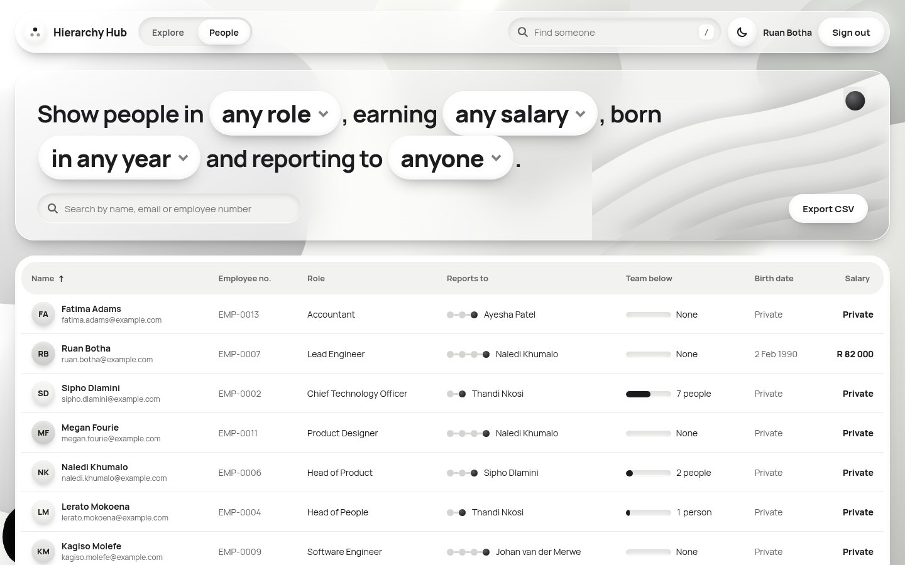

| You are              | You can see the salary and birth date of | You can change                                                                       |
| -------------------- | ---------------------------------------- | ------------------------------------------------------------------------------------ |
| Anyone               | Yourself                                 | Your own name and email                                                              |
| Someone with a team  | Yourself and everyone below you          | Anything about people below you, and move them to yourself or someone else below you |
| An admin             | The same                                 | Also add and delete people below you, and manage their accounts (section 11)         |
| At the top (the CEO) | Everyone                                 | Everyone                                                                             |

This means:

- nobody can give themselves a raise, change their own role, or choose their own manager
- nobody can change anyone above them or beside them, so a junior can never make their manager report to them
- you can only move people within your own part of the organisation, so nobody can be moved out of your reach or under someone more senior

Salaries and birth dates you can't see show as **Private** everywhere: in the details panel, on the People page and in CSV exports. Filtering or sorting by salary or birth date only includes you and the people below you, and the People page says so when that leaves anyone out.

Buttons for things you can't do aren't shown. When editing yourself, the form only has your name and email. The **Reports to** list only offers managers you're allowed to choose.

## 13. The audit page (admins)

Admins see an **Audit** tab in the top bar. It lists everything that happened in your part of the organisation, newest first, as plain sentences such as:

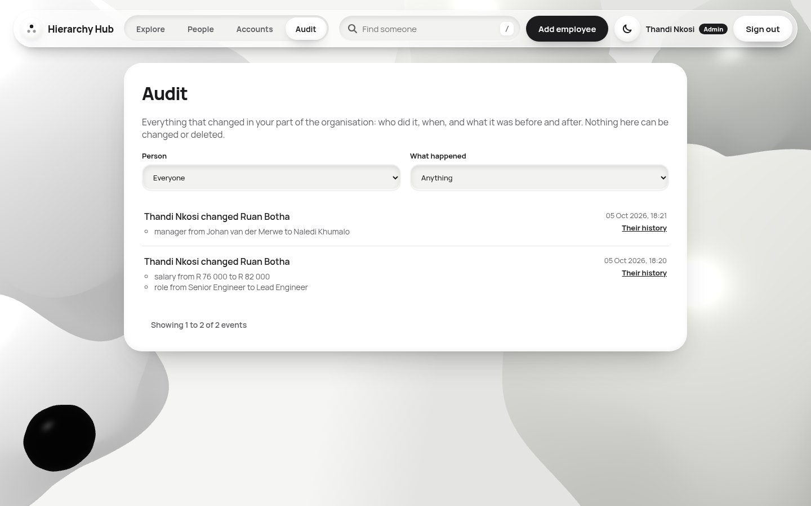

- "Johan van der Merwe changed Ruan Botha", followed by each change, like "role from Senior Engineer to Lead Engineer"
- "Thandi Nkosi deleted Johan van der Merwe. Their team of 4 moved to Sipho Dlamini"
- "Sipho Dlamini made Johan van der Merwe an admin"
- "Ruan Botha signed in", or "Failed sign in for Ruan Botha: wrong password"

Use **Person** and **What happened** to narrow the list. Select **Their history** next to any event, or **View history** in someone's details panel, to see everything about that one person. The address bar keeps your filters, so you can share the link.

You see events about the people who were below you when it happened, and about yourself. You never see events about people above or beside you, so salary changes stay as private here as everywhere else. Every admin sees new requests for an account.

Nothing on this page can be changed or deleted, by anyone. If something was changed by mistake, change it back: both changes will be in the history.

## 14. Pay check

Hierarchy Hub learns what people in your organisation are usually paid for their position, and points out salaries that look out of line.

- **In someone's details**, a **Pay check** note appears when their salary is more than 25% above or below what their position usually earns here, with the usual amount for comparison.
- **On the People page**, flagged salaries have a small tag such as **+43%** or **−31%**.
- **When adding or editing someone**, the Salary field suggests a range, for example "Similar positions here usually earn R 45 000 to R 59 000".

It learns from two things only: how many people are below someone, and whether they manage anyone. It can't know about seniority, skills or experience, so a flag is a prompt to take a look, not a verdict.

It only ever learns from the salaries you're allowed to see (section 12), so it can't reveal anyone else's. It needs at least five salaries to learn from, so people who can only see their own salary don't see pay checks.

## 15. Time travel

The Explore page has a slider above the org chart. Drag it left to see the organisation as it was on an earlier day: people who have since joined disappear, people who have since left come back with their team, and everyone is back in the role and team they had then. The sentence under the slider says what changed at that moment, for example "Ruan Botha moved to Johan van der Merwe's team".

- Select **Play history** to watch the organisation change, one step at a time, from the earliest moment to today.
- Select **Back to today** to return.
- The address bar keeps the moment, so you can share a link to the organisation as it was.

While you're looking at the past, a note says which day it is, and editing, dragging and the pay check are switched off. Salaries aren't kept in the history, so the past shows people and teams only.

History goes back to when Hierarchy Hub started recording changes.
